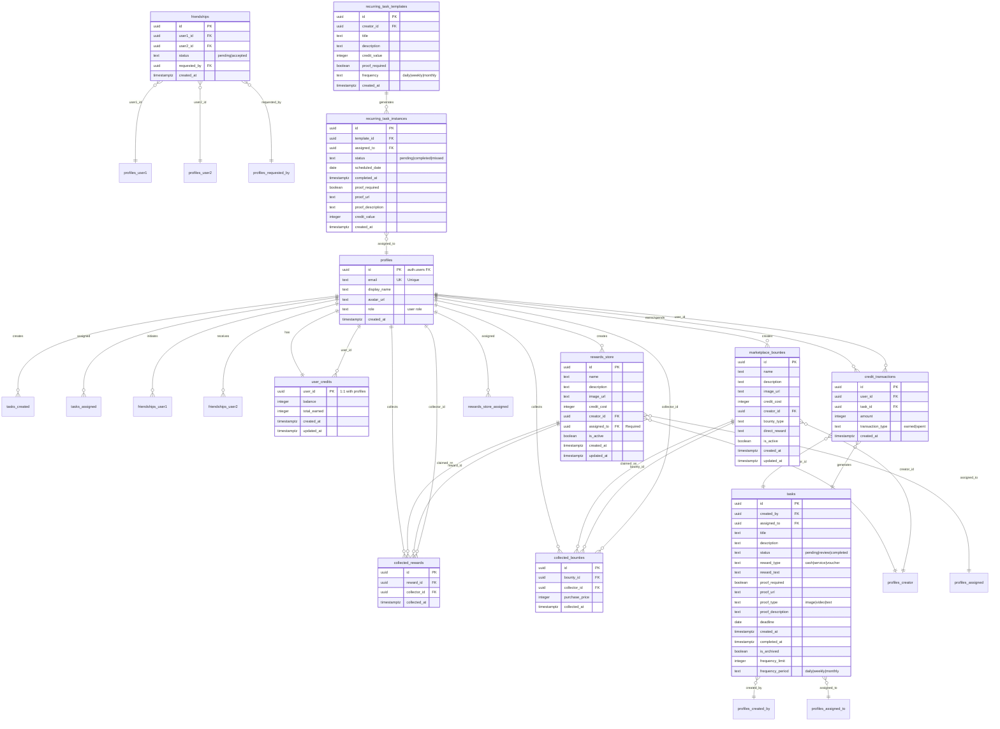

# Bounty Hunter App - Data Model

## Entity Relationship Diagram (ERD)



---

## Table Schemas

### Core Tables

#### 1. profiles

**Purpose**: User account information (1:1 with auth.users)

**Migration**: Initial setup (not visible in repo, assumed from schema)

| Column | Type | Constraints | Description |
|--------|------|-------------|-------------|
| `id` | UUID | PK, FK → auth.users(id) | User ID from Supabase Auth |
| `email` | TEXT | NOT NULL, UNIQUE | User email (from auth) |
| `display_name` | TEXT | NULL | Public username/display name |
| `avatar_url` | TEXT | NULL | Profile picture URL (storage) |
| `role` | TEXT | NULL | User role (unused feature) |
| `created_at` | TIMESTAMPTZ | DEFAULT NOW() | Account creation timestamp |

**Indexes**:
- Primary key on `id`
- Unique index on `email`

**Triggers**:
- `on_auth_user_created` - Auto-creates profile when auth user signs up

**RLS Policies** (from MANUAL_TASKS.md):
```sql
-- Anyone can view profiles (public)
CREATE POLICY "Public profiles" ON profiles
  FOR SELECT USING (true);

-- Users can update their own profile
CREATE POLICY "Update own profile" ON profiles
  FOR UPDATE USING (auth.uid() = id);
```

**Code References**:
- [useAuth.ts:52](../src/hooks/useAuth.ts#L52) - Profile fetch
- [ProfileEditModal.tsx:96](../src/components/ProfileEditModal.tsx#L96) - Profile update
- [Friends.tsx:73](../src/pages/Friends.tsx#L73) - Friend search

---

#### 2. tasks

**Purpose**: Contracts/assignments between users

**Migration**: Initial setup (assumed, not explicitly in repo)

| Column | Type | Constraints | Description |
|--------|------|-------------|-------------|
| `id` | UUID | PK, DEFAULT gen_random_uuid() | Task unique ID |
| `created_by` | UUID | FK → profiles(id) ON DELETE CASCADE | Creator user ID |
| `assigned_to` | UUID | FK → profiles(id) ON DELETE CASCADE | Assignee user ID |
| `title` | TEXT | NOT NULL | Task name |
| `description` | TEXT | NULL | Task details |
| `status` | TEXT | DEFAULT 'pending', CHECK (status IN ('pending', 'in_progress', 'review', 'completed', 'archived', 'rejected')) | Task state |
| `reward_type` | TEXT | CHECK (reward_type IN ('cash', 'service', 'voucher')) | Reward category |
| `reward_text` | TEXT | NULL | Reward description/amount |
| `proof_required` | BOOLEAN | NULL | Whether proof upload is mandatory |
| `proof_url` | TEXT | NULL | Storage URL of proof file |
| `proof_type` | TEXT | CHECK (proof_type IN ('image', 'video', 'text', 'url')) | Proof media type |
| `proof_description` | TEXT | NULL | Text description of proof |
| `deadline` | DATE | NULL | Task due date |
| `created_at` | TIMESTAMPTZ | DEFAULT NOW() | Task creation time |
| `completed_at` | TIMESTAMPTZ | NULL | Completion timestamp |
| `is_archived` | BOOLEAN | DEFAULT FALSE | Archive status |
| `frequency_limit` | INTEGER | NULL | (Recurring feature - unused) |
| `frequency_period` | TEXT | NULL | (Recurring feature - unused) |

**Indexes**:
- Primary key on `id`
- Index on `created_by` (query by creator)
- Index on `assigned_to` (query by assignee)

**RLS Policies** (from MANUAL_TASKS.md):
```sql
-- Users can view tasks they created or are assigned to
CREATE POLICY "View tasks" ON tasks
  FOR SELECT USING (auth.uid() IN (created_by, assigned_to));

-- Users can create tasks (creator must match auth.uid())
CREATE POLICY "Create tasks" ON tasks
  FOR INSERT WITH CHECK (auth.uid() = created_by);

-- Users can update tasks they're involved in
CREATE POLICY "Update tasks" ON tasks
  FOR UPDATE USING (auth.uid() IN (created_by, assigned_to));
```

**Code References**:
- [useTasks.ts:97-107](../src/hooks/useTasks.ts#L97-L107) - Task queries
- [Dashboard.tsx:84](../src/pages/Dashboard.tsx#L84) - Proof upload
- [IssuedPage.tsx:139](../src/pages/IssuedPage.tsx#L139) - Task approval

---

#### 3. friendships

**Purpose**: Social connections between users

**Migration**: Initial setup (assumed, from MANUAL_TASKS.md)

| Column | Type | Constraints | Description |
|--------|------|-------------|-------------|
| `id` | UUID | PK, DEFAULT gen_random_uuid() | Friendship ID |
| `user1_id` | UUID | FK → profiles(id) ON DELETE CASCADE | First user in pair |
| `user2_id` | UUID | FK → profiles(id) ON DELETE CASCADE | Second user in pair |
| `status` | TEXT | DEFAULT 'pending' | 'pending' or 'accepted' |
| `requested_by` | UUID | FK → profiles(id) | Who initiated request |
| `created_at` | TIMESTAMPTZ | DEFAULT NOW() | Request timestamp |

**Constraints**:
```sql
CONSTRAINT unique_friendship UNIQUE(user1_id, user2_id),
CONSTRAINT no_self_friendship CHECK (user1_id != user2_id)
```

**RLS Policies** (from MANUAL_TASKS.md):
```sql
-- Users can view friendships they're part of
CREATE POLICY "View friendships" ON friendships
  FOR SELECT USING (auth.uid() IN (user1_id, user2_id));

-- Users can create friendships (requester must match auth.uid())
CREATE POLICY "Create friendships" ON friendships
  FOR INSERT WITH CHECK (auth.uid() = requested_by);

-- Users can update friendships they're part of (accept/reject)
CREATE POLICY "Update friendships" ON friendships
  FOR UPDATE USING (auth.uid() IN (user1_id, user2_id));
```

**Code References**:
- [useFriends.ts:67](../src/hooks/useFriends.ts#L67) - Fetch friendships
- [useFriends.ts:147](../src/hooks/useFriends.ts#L147) - Send request
- [Friends.tsx:83](../src/pages/Friends.tsx#L83) - Search by email

---

#### 4. user_credits

**Purpose**: User credit balances (1:1 with profiles)

**Migration**: Assumed from schema (not explicit in repo)

| Column | Type | Constraints | Description |
|--------|------|-------------|-------------|
| `user_id` | UUID | PK, FK → profiles(id) ON DELETE CASCADE | User reference |
| `balance` | INTEGER | DEFAULT 0 | Current credit balance |
| `total_earned` | INTEGER | DEFAULT 0 | Lifetime credits earned |
| `created_at` | TIMESTAMPTZ | DEFAULT NOW() | Record creation time |
| `updated_at` | TIMESTAMPTZ | DEFAULT NOW() | Last balance update |

**Triggers**:
- Update `updated_at` on every balance change (assumed)

**RLS Policies**:
- ⚠️ **MISSING** - No visible policies in repo. See [open-questions.md](./open-questions.md).

**Code References**:
- [UserCredits.tsx:36](../src/components/UserCredits.tsx#L36) - Fetch balance
- [IssuedPage.tsx:165](../src/pages/IssuedPage.tsx#L165) - Increment credits (RPC)

---

#### 5. credit_transactions

**Purpose**: Audit log of credit changes

**Migration**: Assumed from schema

| Column | Type | Constraints | Description |
|--------|------|-------------|-------------|
| `id` | UUID | PK, DEFAULT gen_random_uuid() | Transaction ID |
| `user_id` | UUID | FK → profiles(id) ON DELETE CASCADE | User affected |
| `task_id` | UUID | FK → tasks(id) ON DELETE CASCADE | Related task (if earned) |
| `amount` | INTEGER | NOT NULL | Credit amount (+/-) |
| `transaction_type` | TEXT | CHECK ('earned', 'spent') | Credit source |
| `created_at` | TIMESTAMPTZ | DEFAULT NOW() | Transaction timestamp |

**RLS Policies**:
- ⚠️ **MISSING** - Not visible in repo.

**Code References**:
- **None** - Not queried in app code (unused feature?)

---

### Rewards System Tables

#### 6. rewards_store

**Purpose**: Bounties claimable with credits

**Migration**: Implied by RPC functions, but table creation not in repo

| Column | Type | Constraints | Description |
|--------|------|-------------|-------------|
| `id` | UUID | PK, DEFAULT gen_random_uuid() | Reward ID |
| `name` | TEXT | NOT NULL | Reward title |
| `description` | TEXT | NULL | Reward details |
| `image_url` | TEXT | NULL | Card image URL |
| `credit_cost` | INTEGER | NOT NULL, CHECK (>= 0) | Purchase price |
| `creator_id` | UUID | FK → profiles(id) ON DELETE CASCADE | Who created reward |
| `assigned_to` | UUID | NOT NULL, FK → profiles(id) | Who can claim (personalized) |
| `is_active` | BOOLEAN | DEFAULT TRUE | Visibility in store |
| `created_at` | TIMESTAMPTZ | DEFAULT NOW() | Creation time |
| `updated_at` | TIMESTAMPTZ | DEFAULT NOW() | Last modification |

**Triggers**:
```sql
CREATE TRIGGER on_rewards_store_updated
  BEFORE UPDATE ON rewards_store
  FOR EACH ROW EXECUTE FUNCTION handle_updated_at();
```

**RLS Policies**:
- ⚠️ **CRITICAL ISSUE** - Policies defined in [YYYYMMDDHHMMSS_create_bounties_table.sql](../supabase/migrations/YYYYMMDDHHMMSS_create_bounties_table.sql) but for table `bounties`, not `rewards_store`. See [overview.md - Risk #1](../docs/overview.md#top-10-risks).

**Code References**:
- [useRewardsStore.ts:71](../src/hooks/useRewardsStore.ts#L71) - Fetch rewards
- [useCreateBounty.ts:34](../src/hooks/useCreateBounty.ts#L34) - Create reward (RPC)
- [usePurchaseBounty.ts:31](../src/hooks/usePurchaseBounty.ts#L31) - Purchase reward (RPC)

---

#### 7. collected_rewards

**Purpose**: Record of claimed rewards

**Migration**: Implied, not explicit in repo

| Column | Type | Constraints | Description |
|--------|------|-------------|-------------|
| `id` | UUID | PK, DEFAULT gen_random_uuid() | Collection ID |
| `reward_id` | UUID | FK → rewards_store(id) ON DELETE RESTRICT | Reward claimed |
| `collector_id` | UUID | FK → profiles(id) ON DELETE CASCADE | Who claimed |
| `collected_at` | TIMESTAMPTZ | DEFAULT NOW() | Claim timestamp |

**Constraints**:
- **Missing**: `UNIQUE(reward_id, collector_id)` to prevent duplicates (see [overview.md - Fast Fix #2](../docs/overview.md#top-10-fast-fixes))

**RLS Policies**:
- ⚠️ **MISSING** - Not visible in repo.

**Code References**:
- [useCollectedRewards.ts:53](../src/hooks/useCollectedRewards.ts#L53) - Fetch collected
- [useRewardsStore.ts:154](../src/hooks/useRewardsStore.ts#L154) - Create collection (RPC)

---

#### 8. marketplace_bounties

**Purpose**: ⚠️ **DUPLICATE** of `rewards_store` (schema confusion)

**Migration**: [YYYYMMDDHHMMSS_create_bounties_table.sql](../supabase/migrations/YYYYMMDDHHMMSS_create_bounties_table.sql)

| Column | Type | Constraints | Description |
|--------|------|-------------|-------------|
| `id` | UUID | PK, DEFAULT gen_random_uuid() | Bounty ID |
| `name` | TEXT | NOT NULL | Bounty name |
| `description` | TEXT | NULL | Bounty details |
| `image_url` | TEXT | NULL | Card image |
| `credit_cost` | INTEGER | NOT NULL, DEFAULT 0, CHECK (>= 0) | Purchase price |
| `creator_id` | UUID | FK → profiles(id) ON DELETE CASCADE | Creator |
| `bounty_type` | TEXT | NULL | (Unused field) |
| `direct_reward` | TEXT | NULL | (Unused field) |
| `is_active` | BOOLEAN | DEFAULT TRUE | Active status |
| `created_at` | TIMESTAMPTZ | DEFAULT NOW() | Creation time |
| `updated_at` | TIMESTAMPTZ | NOT NULL, DEFAULT NOW() | Last update |

**RLS Policies** (from migration):
```sql
CREATE POLICY "Allow public read access to active bounties" ON bounties
  FOR SELECT USING (is_active = true);

CREATE POLICY "Allow authenticated users to create bounties" ON bounties
  FOR INSERT TO authenticated WITH CHECK (auth.uid() = creator_id);

CREATE POLICY "Allow creator to update their own bounties" ON bounties
  FOR UPDATE TO authenticated USING (auth.uid() = creator_id);

CREATE POLICY "Allow creator to delete their own bounties" ON bounties
  FOR DELETE TO authenticated USING (auth.uid() = creator_id);
```

**⚠️ CRITICAL**: App code queries `rewards_store`, but migrations define `bounties` (marketplace_bounties). See [open-questions.md](./open-questions.md).

**Code References**:
- **None** - App does not use this table.

---

#### 9. collected_bounties

**Purpose**: ⚠️ **DUPLICATE** of `collected_rewards`

**Migration**: [YYYYMMDDHHMMSS_create_collected_bounties_table.sql](../supabase/migrations/YYYYMMDDHHMMSS_create_collected_bounties_table.sql)

| Column | Type | Constraints | Description |
|--------|------|-------------|-------------|
| `id` | UUID | PK, DEFAULT gen_random_uuid() | Collection ID |
| `bounty_id` | UUID | FK → marketplace_bounties(id) ON DELETE RESTRICT | Bounty claimed |
| `collector_id` | UUID | FK → profiles(id) ON DELETE CASCADE | Collector |
| `purchase_price` | INTEGER | NOT NULL, CHECK (>= 0) | Price at time of claim |
| `collected_at` | TIMESTAMPTZ | DEFAULT NOW() | Claim timestamp |

**Indexes**:
```sql
CREATE INDEX idx_collected_bounties_collector_id ON collected_bounties(collector_id);
CREATE INDEX idx_collected_bounties_bounty_id ON collected_bounties(bounty_id);
```

**RLS Policies** (from migration):
```sql
CREATE POLICY "Allow collector to read their own collected bounties" ON collected_bounties
  FOR SELECT TO authenticated USING (auth.uid() = collector_id);
```

**Code References**:
- **None** - App uses `collected_rewards` instead.

---

### Recurring Tasks (Unused Feature)

#### 10. recurring_task_templates

**Purpose**: Definitions for recurring tasks (UNUSED)

**Migration**: Not explicit, but referenced in [complete_task_instance.sql](../supabase/migrations/20231117000000_complete_task_instance.sql)

| Column | Type | Constraints | Description |
|--------|------|-------------|-------------|
| `id` | UUID | PK | Template ID |
| `creator_id` | UUID | FK → profiles(id) | Creator |
| `title` | TEXT | NOT NULL | Task title |
| `description` | TEXT | NULL | Task details |
| `credit_value` | INTEGER | NOT NULL | Reward amount |
| `proof_required` | BOOLEAN | DEFAULT FALSE | Proof mandatory |
| `frequency` | TEXT | CHECK ('daily', 'weekly', 'monthly') | Recurrence |
| `created_at` | TIMESTAMPTZ | DEFAULT NOW() | Creation time |

**Code References**:
- **None** - Feature not implemented in frontend.

---

#### 11. recurring_task_instances

**Purpose**: Single occurrences of recurring tasks (UNUSED)

**Migration**: [20250615224500_create_or_update_recurring_task_instances.sql](../supabase/migrations/20250615224500_create_or_update_recurring_task_instances.sql)

| Column | Type | Constraints | Description |
|--------|------|-------------|-------------|
| `id` | UUID | PK, DEFAULT gen_random_uuid() | Instance ID |
| `template_id` | UUID | FK → recurring_task_templates(id) ON DELETE CASCADE | Template reference |
| `assigned_to` | UUID | FK → profiles(id) ON DELETE SET NULL | Assignee |
| `status` | TEXT | NOT NULL, DEFAULT 'pending' | 'pending', 'completed', 'missed', 'approved' |
| `scheduled_date` | DATE | NOT NULL | Due date |
| `completed_at` | TIMESTAMPTZ | NULL | Completion time |
| `proof_required` | BOOLEAN | DEFAULT TRUE | (Copied from template) |
| `proof_url` | TEXT | NULL | Storage link |
| `proof_description` | TEXT | NULL | Text proof |
| `credit_value` | INTEGER | NULL | (Copied from template) |
| `created_at` | TIMESTAMPTZ | DEFAULT NOW() | Creation time |

**Indexes**:
```sql
CREATE INDEX idx_recurring_task_instances_template_id ON recurring_task_instances(template_id);
CREATE INDEX idx_recurring_task_instances_assigned_to ON recurring_task_instances(assigned_to);
CREATE INDEX idx_recurring_task_instances_scheduled_date ON recurring_task_instances(scheduled_date);
CREATE INDEX idx_recurring_task_instances_status ON recurring_task_instances(status);
```

**Code References**:
- **None** - Not used in app.

---

## RPC Functions

### 1. create_reward_store_item

**Migration**: [YYYYMMDDHHMMSS_create_bounty_rpc.sql](../supabase/migrations/YYYYMMDDHHMMSS_create_bounty_rpc.sql)

**Signature**:
```sql
create_reward_store_item(
  p_name TEXT,
  p_description TEXT,
  p_image_url TEXT,
  p_credit_cost INTEGER,
  p_assigned_to UUID
) RETURNS JSONB
```

**Logic**:
1. Validate inputs (name not empty, credit_cost > 0)
2. Insert into `rewards_store` table
3. Return `{ success: TRUE, reward_id: <uuid> }`

**Security**: `SECURITY DEFINER`, granted to `authenticated` role.

**Caller**: [useCreateBounty.ts:34](../src/hooks/useCreateBounty.ts#L34)

---

### 2. update_reward_store_item

**Migration**: Not visible in repo (likely in same file as create)

**Signature**:
```sql
update_reward_store_item(
  p_bounty_id UUID,
  p_name TEXT,
  p_description TEXT,
  p_image_url TEXT,
  p_credit_cost INTEGER
) RETURNS JSONB
```

**Logic**:
1. Update `rewards_store` WHERE id = p_bounty_id
2. Return success status

**Security**: `SECURITY DEFINER`

**Caller**: [useUpdateBounty.ts:19](../src/hooks/useUpdateBounty.ts#L19)

---

### 3. delete_reward_store_item

**Migration**: Not visible in repo

**Signature**:
```sql
delete_reward_store_item(p_bounty_id UUID) RETURNS JSONB
```

**Logic**:
1. DELETE FROM `rewards_store` WHERE id = p_bounty_id
2. Return success status

**Security**: `SECURITY DEFINER`

**Caller**: [useDeleteBounty.ts:17](../src/hooks/useDeleteBounty.ts#L17)

---

### 4. purchase_bounty

**Migration**: [YYYYMMDDHHMMSS_purchase_bounty_rpc.sql](../supabase/migrations/YYYYMMDDHHMMSS_purchase_bounty_rpc.sql)

**Signature**:
```sql
purchase_reward_store_item(
  p_reward_id UUID,
  p_collector_id UUID
) RETURNS JSONB
```

**Logic**:
1. Check reward exists and is active
2. Check collector is not the creator (prevent self-purchase)
3. Check collector hasn't already claimed this reward
4. Call `decrement_user_credits(p_collector_id, credit_cost)`
5. Insert into `collected_rewards`
6. Return success with reward name

**Security**: `SECURITY DEFINER`, granted to `authenticated`

**⚠️ Race Condition**: Step 3 check + step 5 insert not atomic. See [overview.md - Risk #7](../docs/overview.md#top-10-risks).

**Caller**: [usePurchaseBounty.ts:31](../src/hooks/usePurchaseBounty.ts#L31)

---

### 5. increment_user_credits

**Migration**: [YYYYMMDDHHMMSS_increment_user_credits_rpc.sql](../supabase/migrations/YYYYMMDDHHMMSS_increment_user_credits_rpc.sql)

**Signature**:
```sql
increment_user_credits(
  user_id_param UUID,
  amount_param INT
) RETURNS VOID
```

**Logic**:
1. Attempt UPDATE `user_credits` SET balance = balance + amount WHERE user_id = user_id_param
2. If no row found, INSERT new row with initial balance = amount

**Security**: ⚠️ **VULNERABLE** - Granted to `authenticated` role, callable by clients. See [overview.md - Risk #2](../docs/overview.md#top-10-risks).

**Caller**: [IssuedPage.tsx:165](../src/pages/IssuedPage.tsx#L165) - **DIRECT CLIENT CALL**

**Fix Required**: Revoke `authenticated` access, move to service_role or server-side trigger.

---

### 6. decrement_user_credits

**Migration**: [YYYYMMDDHHMMSS_decrement_user_credits_rpc.sql](../supabase/migrations/YYYYMMDDHHMMSS_decrement_user_credits_rpc.sql)

**Signature**:
```sql
decrement_user_credits(
  user_id_param UUID,
  amount_param INT
) RETURNS BOOLEAN
```

**Logic**:
1. Fetch current balance
2. If balance >= amount, deduct and return TRUE
3. Else return FALSE (insufficient funds)

**Security**: `SECURITY DEFINER`, granted to `authenticated`

**Caller**: `purchase_bounty` RPC (server-side)

**Safe**: Cannot be exploited since it only deducts, and purchase logic validates.

---

### 7. complete_task_instance

**Migration**: [20231117000000_complete_task_instance.sql](../supabase/migrations/20231117000000_complete_task_instance.sql)

**Signature**:
```sql
complete_task_instance(
  instance_id_param UUID,
  user_id_param UUID,
  proof_description_param TEXT DEFAULT NULL
) RETURNS TABLE (j JSONB)
```

**Logic**:
1. Fetch instance and template details
2. If proof not required:
   - Set status = 'completed'
   - Award credits via `increment_user_credits`
3. If proof required:
   - Validate proof provided
   - Set status = 'review'
   - Store proof description
4. Return success/error message

**Security**: `SECURITY DEFINER`, granted to `authenticated`

**Status**: **UNUSED** - Recurring tasks not implemented in frontend.

---

## Storage Buckets

### 1. bounty-proofs

**Purpose**: Task proof uploads (images/videos)

**Visibility**: PUBLIC (anyone with URL can view)

**Policies**:
```sql
-- Assumed (not visible in repo):
CREATE POLICY "Authenticated users can upload"
  ON storage.objects FOR INSERT
  TO authenticated
  WITH CHECK (bucket_id = 'bounty-proofs');

CREATE POLICY "Anyone can view"
  ON storage.objects FOR SELECT
  TO public
  USING (bucket_id = 'bounty-proofs');
```

**File Structure**:
- Path: `proofs/{taskId}/{timestamp}.{ext}`
- Example: `proofs/a1b2c3d4-e5f6-7890-abcd-ef1234567890/1234567890.jpg`

**Code References**:
- [useTasks.ts:532](../src/hooks/useTasks.ts#L532) - Upload
- [Dashboard.tsx:64](../src/pages/Dashboard.tsx#L64) - Upload proof

---

### 2. avatars

**Purpose**: User profile pictures

**Visibility**: PUBLIC

**Policies**: (Assumed, same as bounty-proofs)

**File Structure**:
- Path: `{userId}.{ext}` (assumed)
- Example: `a1b2c3d4-e5f6-7890-abcd-ef1234567890.png`

**Code References**:
- [ProfileEditModal.tsx:84](../src/components/ProfileEditModal.tsx#L84) - Upload avatar

---

## Indexes

### Existing Indexes (from migrations)

| Table | Column(s) | Type | Purpose |
|-------|-----------|------|---------|
| `profiles` | `id` | PRIMARY KEY | Unique user ID |
| `profiles` | `email` | UNIQUE | Email lookup |
| `tasks` | `id` | PRIMARY KEY | Unique task ID |
| `tasks` | `created_by` | INDEX | Query by creator |
| `tasks` | `assigned_to` | INDEX | Query by assignee |
| `friendships` | `id` | PRIMARY KEY | Unique friendship |
| `friendships` | `(user1_id, user2_id)` | UNIQUE | Prevent duplicates |
| `collected_bounties` | `collector_id` | INDEX | Query by collector |
| `collected_bounties` | `bounty_id` | INDEX | Query by bounty |
| `recurring_task_instances` | `template_id` | INDEX | Query by template |
| `recurring_task_instances` | `assigned_to` | INDEX | Query by assignee |
| `recurring_task_instances` | `scheduled_date` | INDEX | Query by date |
| `recurring_task_instances` | `status` | INDEX | Query by status |

### Missing Indexes (Recommendations)

| Table | Column(s) | Reason |
|-------|-----------|--------|
| `rewards_store` | `is_active` | Frequently filtered in store queries |
| `rewards_store` | `assigned_to` | Query rewards for specific users |
| `tasks` | `status` | Filter by status in dashboards |
| `tasks` | `is_archived` | Separate active from archived |
| `collected_rewards` | `collector_id` | Query user's collected rewards |

---

## Triggers

### 1. handle_new_user (profiles auto-creation)

**Location**: MANUAL_TASKS.md (not in migration files)

**Trigger**:
```sql
CREATE TRIGGER on_auth_user_created
  AFTER INSERT ON auth.users
  FOR EACH ROW EXECUTE FUNCTION handle_new_user();
```

**Function**:
```sql
CREATE OR REPLACE FUNCTION handle_new_user()
RETURNS TRIGGER AS $$
BEGIN
  INSERT INTO profiles (id, email, display_name, avatar_url)
  VALUES (
    new.id,
    new.email,
    SPLIT_PART(new.email, '@', 1),  -- Use email prefix as display_name
    new.raw_user_meta_data->>'avatar_url'
  );
  RETURN new;
END;
$$ LANGUAGE plpgsql SECURITY DEFINER;
```

---

### 2. handle_bounties_updated_at (timestamp update)

**Location**: [YYYYMMDDHHMMSS_create_bounties_table.sql:32-38](../supabase/migrations/YYYYMMDDHHMMSS_create_bounties_table.sql#L32-L38)

**Trigger**:
```sql
CREATE TRIGGER on_bounties_updated
  BEFORE UPDATE ON bounties
  FOR EACH ROW EXECUTE FUNCTION handle_bounties_updated_at();
```

**Function**:
```sql
CREATE OR REPLACE FUNCTION handle_bounties_updated_at()
RETURNS TRIGGER AS $$
BEGIN
  NEW.updated_at = now();
  RETURN NEW;
END;
$$ LANGUAGE plpgsql;
```

**Note**: Applied to `bounties` table (marketplace_bounties), but app uses `rewards_store` which likely needs same trigger.

---

## Data Integrity Constraints

### Foreign Key Cascade Behaviors

| Parent Table | Child Table | Column | ON DELETE |
|--------------|-------------|--------|-----------|
| profiles | tasks | created_by | CASCADE |
| profiles | tasks | assigned_to | CASCADE |
| profiles | friendships | user1_id | CASCADE |
| profiles | friendships | user2_id | CASCADE |
| profiles | friendships | requested_by | (none) |
| profiles | user_credits | user_id | CASCADE |
| profiles | rewards_store | creator_id | CASCADE |
| profiles | rewards_store | assigned_to | (none) |
| profiles | collected_rewards | collector_id | CASCADE |
| rewards_store | collected_rewards | reward_id | **RESTRICT** (prevent deletion if claimed) |
| profiles | recurring_task_instances | assigned_to | SET NULL |
| recurring_task_templates | recurring_task_instances | template_id | CASCADE |

### Check Constraints

| Table | Column | Constraint |
|-------|--------|------------|
| tasks | status | IN ('pending', 'in_progress', 'review', 'completed', 'archived', 'rejected') |
| tasks | reward_type | IN ('cash', 'service', 'voucher') |
| tasks | proof_type | IN ('image', 'video', 'text', 'url') |
| friendships | user1_id, user2_id | `user1_id != user2_id` (no self-friendship) |
| rewards_store | credit_cost | `>= 0` |
| collected_bounties | purchase_price | `>= 0` |

---

## Schema Discrepancies & Issues

### 1. Table Name Confusion

**Problem**: Migrations define `bounties` (marketplace_bounties), but app queries `rewards_store`.

**Evidence**:
- Migration: [YYYYMMDDHHMMSS_create_bounties_table.sql](../supabase/migrations/YYYYMMDDHHMMSS_create_bounties_table.sql) creates `bounties`
- App code: [useRewardsStore.ts:71](../src/hooks/useRewardsStore.ts#L71) queries `rewards_store`

**Impact**: App will fail if migrations run without manual table rename.

**Fix**: Align migration to create `rewards_store` instead of `bounties`.

---

### 2. RLS Policies Incomplete

**Missing Policies**:
- `rewards_store` - No policies visible (policies defined for `bounties` table)
- `user_credits` - No policies
- `collected_rewards` - No policies
- `credit_transactions` - No policies

**Risk**: Unauthorized access or data leakage.

**Fix**: Apply RLS policies to all tables. See [open-questions.md](./open-questions.md).

---

### 3. Duplicate Tables

**Duplicates**:
1. `bounties` (marketplace_bounties) ≈ `rewards_store`
2. `collected_bounties` ≈ `collected_rewards`

**Resolution**: Remove migration files for `bounties`/`collected_bounties`, or remove `rewards_store`/`collected_rewards` from actual database.

---

### 4. Recurring Tasks Feature Incomplete

**Tables Created**:
- `recurring_task_templates`
- `recurring_task_instances`

**Status**: Not used in frontend, RPC function defined but not called.

**Recommendation**: Remove tables or fully implement feature.

---

## Migration Checklist

Before deploying migrations:

- [ ] Rename `bounties` → `rewards_store` in [YYYYMMDDHHMMSS_create_bounties_table.sql](../supabase/migrations/YYYYMMDDHHMMSS_create_bounties_table.sql)
- [ ] Rename `collected_bounties` → `collected_rewards` in [YYYYMMDDHHMMSS_create_collected_bounties_table.sql](../supabase/migrations/YYYYMMDDHHMMSS_create_collected_bounties_table.sql)
- [ ] Add RLS policies for `rewards_store`, `user_credits`, `collected_rewards`
- [ ] Add UNIQUE constraint on `collected_rewards(reward_id, collector_id)`
- [ ] Replace `YYYYMMDDHHMMSS` timestamps with actual values (e.g., `20250101120000`)
- [ ] Revoke `authenticated` access to `increment_user_credits`
- [ ] Add missing indexes (see recommendations above)
- [ ] Decide on recurring tasks feature: implement or remove
- [ ] Test all RPC functions with RLS enabled

---

**Last Updated**: 2025-10-25
**Status**: Schema drift identified, requires alignment before production deployment.
