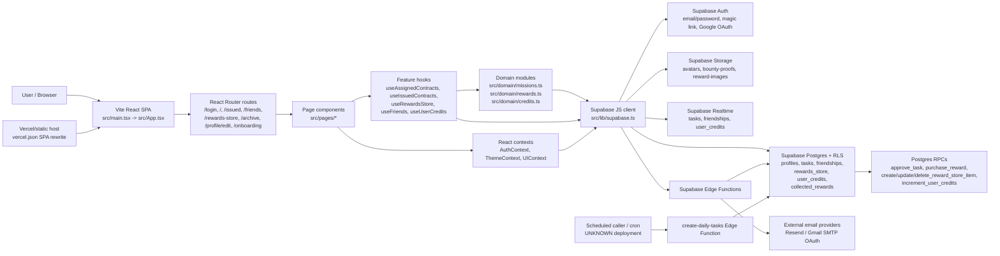
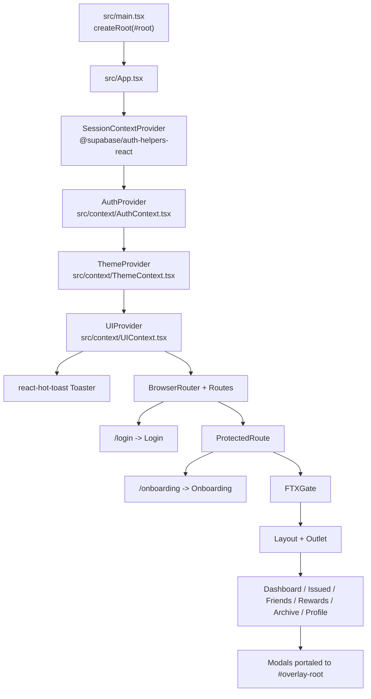

# 1. Architecture Summary

This repository is a hybrid frontend-plus-Supabase application. The user-facing runtime is a Vite React single-page app, deployed as static assets with an SPA fallback (`vercel.json`). The backend/runtime services are Supabase Auth, Supabase Postgres with Row Level Security, Supabase Storage, Supabase Realtime, Supabase RPC functions, and Supabase Edge Functions. There is no Express/Next.js server in this repo.

Primary runtime processes:

- Browser SPA: `src/main.tsx` mounts `src/App.tsx` into `#root` from `index.html`.
- React Router: `src/App.tsx` owns all browser routes and route protection.
- Supabase client: `src/lib/supabase.ts` creates the browser client from `VITE_SUPABASE_URL` and `VITE_SUPABASE_ANON_KEY`.
- Supabase Postgres/API: browser code calls `.from(...)`, `.rpc(...)`, storage, auth, realtime, and edge functions directly.
- Supabase Edge Functions: `supabase/functions/*/index.ts` run on Deno/Supabase for notification and scheduled/background-style behavior.
- Static deployment: `vercel.json` rewrites all paths to `/index.html`.

Connections:

- Auth is Supabase Auth via `@supabase/supabase-js` and `@supabase/auth-helpers-react`.
- Session/profile state is centralized in `src/context/AuthContext.tsx`; profile bootstrapping is in `src/lib/profileBootstrap.ts`.
- Database tables used directly by the app include `profiles`, `tasks`, `friendships`, `rewards_store`, `collected_rewards`, `user_credits`, `credit_transactions`, `daily_mission_streaks`, and recurring-task tables.
- Storage buckets referenced by code are `avatars`, `bounty-proofs`, and `reward-images`.
- External services visible in code are Google OAuth/Supabase Auth, Google Fonts, placeholder avatar URLs (`avatar.iran.liara.run`), Resend (`notify-reward-creator`), Gmail SMTP/OAuth via Nodemailer (`send-new-bounty-alert`, `send-proof-submitted-alert`), and Vercel/static hosting.
- UNKNOWN: the exact deployed Supabase project state. `supabase/schema.sql`, `supabase/schema_all.sql`, and migrations differ in places, so this document marks conflicts explicitly.

# 2. High-Level System Diagram

# 3. Routing Map

## Frontend/page routes

| URL/path | File path | Page/component | Purpose | Auth requirement | Data loaded | Data mutated | Components/services used | Status |
|---|---|---|---|---|---|---|---|---|
| `/login` | `src/App.tsx`, `src/pages/Login.tsx` | `Login` | Public auth entrypoint for Google OAuth, email/password sign-up/login, magic link. | Public; redirects authenticated users to `/`. | `useAuth()` for current user/loading. | Supabase Auth: `signUp`, `signInWithPassword`, `signInWithOAuth`, `signInWithOtp`. | `supabase`, `toast`, `useNavigate`. | Active |
| `/` | `src/App.tsx`, `src/pages/Dashboard.tsx` | `Dashboard` inside `ProtectedRoute` + `FTXGate` + `Layout` | Mission inbox for tasks assigned to current user. | Requires Supabase session and profile gate; may redirect to `/onboarding`. | `useAssignedContracts`, `useIssuedContracts`, `useUserCredits`, `useDailyQuote`. | Task status/proof/archive via `src/domain/missions.ts`. | `TaskCard`, `PullToRefresh`, `StatsRow`, `BaseCard`, `soundManager`. | Active |
| `/issued` | `src/App.tsx`, `src/pages/IssuedPage.tsx` | `IssuedPage` | Missions/tasks created by current user; create, edit, delete, approve/reject, archive. | Protected + FTXGate. | `useIssuedContracts`, `useDailyQuote`, auth user. | `tasks` insert/update/delete, `approve_task` RPC, task reject/archive updates. | `TaskCard`, `TaskForm`, `ConfirmDeleteModal`, `approveMission`, `rejectMission`, `archiveMission`. | Active |
| `/friends` | `src/App.tsx`, `src/pages/Friends.tsx` | `Friends` | Friend/guild/family roster and couple-mode partner selection/invites. | Protected + FTXGate. | `useFriends`, `usePartnerState`, `useAuth`, `ThemeContext`. | `friendships` insert/update/delete; `profiles.partner_user_id` update through `setPartner`. | `FriendCard`, `ConfirmDeleteModal`, `supabase`, `soundManager`. | Active, but DB column `partner_user_id` is UNKNOWN in migrations/schema inspected |
| `/rewards-store` | `src/App.tsx`, `src/pages/RewardsStorePage.tsx` | `RewardsStorePage` | Available/created/collected rewards store. | Protected + FTXGate. | `useRewardsStore`, `useCollectedRewards`, `useUserCredits`. | Reward create/update/delete/claim through RPCs and storage upload. | `RewardCard`, `CreateBountyModal`, `EditBountyModal`, `ConfirmDialog`, `usePurchaseBounty`, `useDeleteBounty`. | Active |
| `/my-rewards` | `src/App.tsx`, `src/pages/MyCollectedRewardsPage.tsx` | `MyCollectedRewardsPage` | Separate collected rewards page. | Protected + FTXGate. | None. | None. | Page shell only. | Partial/mocked; text says under construction |
| `/archive` | `src/App.tsx`, `src/pages/ArchivePage.tsx` | `ArchivePage` | History view for archived assigned tasks. | Protected + FTXGate. Hidden from current `Layout` nav. | `useArchivedContracts`. | None from this page. | `TaskCard`. | Partial/active but hidden |
| `/profile/edit` | `src/App.tsx`, `src/pages/ProfileEdit.tsx` | `ProfileEdit` | Full page profile editor, theme selector, onboarding restart, Supabase health panel. | Protected + FTXGate. Not currently in `Layout` nav; profile modal is primary UI. | `useAuth`, `ThemeContext`, Supabase health select. | Upload avatar to `avatars`; upsert `profiles`; local theme; local onboarding flag. | `FileUpload`, `BaseCard`, `clearOnboardingFlag`. | Active/internal-ish |
| `/onboarding` | `src/App.tsx`, `src/pages/Onboarding.tsx` | `Onboarding` | First-time setup wizard. | ProtectedRoute only; deliberately not blocked by `FTXGate`. | `useAuth`, theme/profile state. | Local theme, optional `friendships` invite, `localStorage.bounty_onboarding_completed`. | `OnboardingStep1Mode`, `OnboardingStep3Invite`, `OnboardingStep4Mission`. | Active |
| `*` | `src/App.tsx` | `<Navigate to="/" replace />` | Browser catch-all route. | Indirect; redirects to `/` which is protected. | None. | None. | React Router. | Active catch-all |

## API/server routes

There are no local HTTP route handlers such as `/api/*` in the Vite app. API behavior is via Supabase service endpoints generated from database tables/RPCs, storage, auth, realtime, and Edge Functions.

Important browser-to-Supabase contracts:

- Auth endpoints are called through `supabase.auth.*` in `src/pages/Login.tsx`, `src/context/AuthContext.tsx`, and `src/components/Layout.tsx`.
- PostgREST table endpoints are called through `.from(...)` across hooks, pages, and domain modules.
- RPC endpoints are called through `.rpc(...)` in `src/domain/missions.ts`, `src/domain/rewards.ts`, `src/hooks/useCreateBounty.ts`, and legacy `src/hooks/useTasks.ts`.
- Storage endpoints are called through `supabase.storage.from(...)` for `avatars`, `bounty-proofs`, and `reward-images`.

## Webhook routes / Edge Functions

| Edge function path | File path | Method/body | Purpose | Auth requirement | Data loaded/mutated | External services | Status |
|---|---|---|---|---|---|---|---|
| `/functions/v1/notify-reward-creator` | `supabase/functions/notify-reward-creator/index.ts` | JSON `{ reward_id, collector_id }` | Email reward creator after reward purchase. | Requires Bearer token; verifies requester via Supabase Auth; `collector_id` must equal requester. | Reads `collected_rewards`, `rewards_store`, `profiles` using service role. | Resend API (`RESEND_API_KEY`, `RESEND_FROM_EMAIL`). | Active in code; invoked by `useRewardsStore.triggerNotification` only after purchase result with `collection_id` |
| `/functions/v1/create-daily-tasks` | `supabase/functions/create-daily-tasks/index.ts` | Any request; checks `Authorization: Bearer ${SUPABASE_SERVICE_ROLE_KEY}` | Scheduled creation of recurring task instances. | Service role bearer exactly. | Reads `recurring_contract_templates`; reads/inserts `recurring_contract_instances`. | None. | Partial/UNKNOWN: table name mismatch risk with migration using `recurring_task_instances`; scheduled caller not visible |
| `/functions/v1/send-new-bounty-alert` | `supabase/functions/send-new-bounty-alert/index.ts` | JSON `{ assigneeEmail, assigneeName, taskTitle, taskId, appUrl? }` | Email assignee about new bounty. | No explicit auth in function. | None; trusts request body. | Gmail SMTP via Nodemailer/OAuth env vars. | Legacy/unused by current frontend search |
| `/functions/v1/send-proof-submitted-alert` | `supabase/functions/send-proof-submitted-alert/index.ts` | JSON `{ creatorEmail, creatorName, taskTitle, taskId, proofId, appUrl? }` | Email creator when proof submitted. | No explicit auth in function. | None; trusts request body. | Gmail SMTP via Nodemailer/OAuth env vars. | Legacy/unused by current frontend search |

## Admin/internal routes

- `/profile/edit` includes a “System Status” debug panel and Supabase health check. It is user-accessible but functions as internal diagnostics.
- `src/components/dev/ProfileDebugger.tsx` exists but was not found wired into routes.
- No explicit admin route was found. Admin DB policy exists for `tasks` based on `profiles.role = 'admin'`.

## Dynamic routes

No React Router dynamic route is registered. Some legacy emails link to `/dashboard/bounties/${taskId}` or query `?review_proof=...`, but no matching frontend route exists.

## Catch-all routes

- React catch-all: `path="*"` redirects to `/`.
- Vercel catch-all: `vercel.json` rewrites every request to `/index.html`.

# 4. Runtime Flow: User Interaction to Data Change

## Flow A: User logs in and profile bootstraps

1. User opens `/login`; `src/pages/Login.tsx` renders auth controls.
2. Email/password submit calls `supabase.auth.signInWithPassword`; Google calls `supabase.auth.signInWithOAuth`; magic link calls `supabase.auth.signInWithOtp`.
3. `src/context/AuthContext.tsx` calls `supabase.auth.getSession()` on mount and subscribes via `supabase.auth.onAuthStateChange`.
4. When a session user exists, `AuthProvider` calls `ensureProfileForUser(supabase, user)` from `src/lib/profileBootstrap.ts`.
5. `ensureProfileForUser` reads `profiles` by `id`; if absent, inserts `{ id, email, display_name, avatar_url: null, role: null }`.
6. `AuthProvider` stores `user`, `session`, `profile`, `authLoading`, `profileLoading`, and error state.
7. `/` routes are guarded by `ProtectedRoute`; no session redirects to `/login`, otherwise render.
8. `FTXGate` calls `useFTXGateLogic(user?.id, profileLoading)` from `src/lib/ftxGate.ts`; if local onboarding flag is missing and no missions/rewards exist, it redirects to `/onboarding`.
9. Error path: profile bootstrap catches most errors and returns `null`; `AuthContext` may set `profileError`, but route protection only checks session/user.

## Flow B: Create a mission from `/issued`

1. User clicks the floating plus button in `src/pages/IssuedPage.tsx`.
2. `handleCreateNewContract` opens `TaskForm`; if the mobile menu is open it calls `forceCloseMobileMenu()` first.
3. `src/components/TaskForm.tsx` mounts into `#overlay-root` using `getOverlayRoot()` and calls `useUI().openModal()` for overlay/scroll coordination.
4. `TaskForm` loads assignee options using `useFriends(userId)` and validates local fields: title, assignee, reward, length limits, couple-mode self-assignment.
5. On submit, `TaskForm.handleSubmit` builds `NewTaskData` with `created_by`, `status`, `title`, `description`, `assigned_to`, `deadline`, `reward_type`, `reward_text`, `proof_required`.
6. Parent `IssuedPage.handleSubmitContract` receives payload.
7. If creating, it inserts into `tasks` with `created_by: user.id`, `status: 'pending'`, `proof_required` normalized to boolean.
8. Supabase RLS policy must allow `auth.uid() = created_by`.
9. On success, `IssuedPage` calls `refetchIssuedContracts`, which runs `useIssuedContracts.fetchContracts`.
10. `useIssuedContracts` reads `tasks` where `created_by = user.id` and `is_archived = false`, joining creator and assignee profiles.
11. UI updates through React state and closes modal.
12. Error path: Supabase errors are caught in `IssuedPage.handleSubmitContract`, shown through `toast.error`, but `TaskForm` closes after `onSubmit` resolves. `handleSubmitContract` catches internally and does not rethrow, so failed create may still close the modal.

## Flow C: Assignee submits proof or completes without proof

1. Dashboard loads assigned tasks with `useAssignedContracts`.
2. User clicks a `TaskCard`; `TaskCard` opens `MissionModalShell`.
3. For assignee view, primary action “Complete Task” is configured in `TaskCard`.
4. If `task.proof_required === true`, `TaskCard` opens `ProofModal`; submit calls parent `Dashboard.handleProofUpload`.
5. `Dashboard.handleProofUpload` calls `uploadProof` from `src/domain/missions.ts`.
6. `uploadProof` validates file/text. File constraints: max 10MB, type must start with `image/` or `video/`.
7. If a file exists, upload to storage bucket `bounty-proofs` at `proofs/{missionId}/{timestamp}_{file.name}` and get public URL.
8. It updates `tasks` with proof fields, `status: 'review'`, and `completed_at: now`, filtered by `id` and `assigned_to = userId`.
9. Dashboard refreshes assigned contracts and shows success toast.
10. If `proof_required === false`, `TaskCard` calls `Dashboard.handleDirectComplete`, which calls `submitForReviewNoProof`.
11. `submitForReviewNoProof` fetches `tasks` by id, verifies `assigned_to`, verifies `proof_required !== true`, verifies status is `pending`, `in_progress`, or `rejected`, then updates status to `review` and sets `completed_at`.
12. Error path: validation and Supabase errors are thrown from domain functions and converted to toasts in `Dashboard`.

## Flow D: Creator approves or rejects proof

1. Creator visits `/issued`; `useIssuedContracts` loads tasks created by current user.
2. `IssuedPage` passes `onApprove`/`onReject` into `TaskCard` when `isCreatorView=true`.
3. `TaskCard` renders approve/reject actions in `MissionModalShell` for tasks with status `review`.
4. Approve: `IssuedPage.handleApprove` uses a ref guard (`isApprovingRef`) and state guard (`approvingTaskId`) to prevent rapid double-clicks.
5. `handleApprove` calls `approveMission` in `src/domain/missions.ts`.
6. `approveMission` calls Supabase RPC `approve_task(p_task_id)`.
7. Current canonical migration `supabase/migrations/20260109_approve_task_rpc_v3_no_streaks.sql` atomically updates `tasks` from `review` to `completed`, requires `created_by = auth.uid()`, sets `approved_at`, and awards credits exactly once by calling `increment_user_credits` if `reward_type = 'credit'`.
8. `increment_user_credits` is hardened in `20260412100100_lock_down_increment_user_credits.sql` to be service-role only externally, but it is called inside `approve_task` as a trusted `SECURITY DEFINER` path.
9. UI refreshes issued contracts and shows success.
10. Reject: `IssuedPage.handleReject` calls `rejectMission`, which fetches task where `id` and `created_by=issuerId`, runs pure `evaluateStatusChange`, then updates `tasks` to `status: 'pending'` and clears `proof_url`/`proof_type`.
11. Error path: `approveMission` maps known Postgres exception text to user-friendly messages; reject forwards thrown errors.

## Flow E: Create, edit, delete, and claim rewards

1. `/rewards-store` mounts `RewardsStorePage`.
2. It calls `useRewardsStore.fetchRewards`, `useCollectedRewards.fetchCollectedRewards`, and `useUserCredits`.
3. Create button opens `CreateBountyModal`, which selects a friend through `FriendSelector`, accepts reward metadata, optional emoji/upload image.
4. Uploaded reward image uses `uploadRewardImage` in `src/lib/rewardImageUpload.ts`, bucket `reward-images`, path `rewards/{creatorId}/{bountyId}-{timestamp}.{ext}`.
5. `CreateBountyModal.handleSubmit` calls `useCreateBounty.createBounty`, which directly calls RPC `create_reward_store_item`.
6. `src/domain/rewards.ts` also has `createReward`, but `CreateBountyModal` currently uses the hook path, not the dynamic import path from `useRewardsStore.createReward`.
7. RPC `create_reward_store_item` from `20260412100200_phase1_reward_and_rpc_hardening.sql` validates auth, non-empty name, assignee, credit range, accepted friendship, then inserts into `rewards_store`.
8. Edit opens `EditBountyModal`, calls `useUpdateBounty.updateBounty`, which calls domain `updateReward`, which calls RPC `update_reward_store_item`.
9. Delete uses `useDeleteBounty.deleteBounty`, domain `deleteReward`, RPC `delete_reward_store_item`; RPC deletes dependent `collected_rewards` rows then reward.
10. Claim from `RewardCard` calls `RewardsStorePage.handleClaim`, then `usePurchaseBounty.purchaseBounty`, then domain `purchaseReward`.
11. `purchaseReward` gets authenticated user, calls RPC `purchase_reward(p_reward_id, p_collector_id)`.
12. RPC locks user credits and reward rows, rejects unauthenticated, mismatched collector, inactive/missing reward, self-purchase, insufficient funds, and duplicate collection; then inserts `collected_rewards`, inserts a negative `credit_transactions` row, decrements `user_credits.balance`, and marks reward inactive.
13. `usePurchaseBounty` does not trigger `notify-reward-creator`; `useRewardsStore.purchaseReward` does, but `RewardsStorePage` uses `usePurchaseBounty`. This means creator notification may not fire in the current page flow.

## Flow F: Friend and partner management

1. `/friends` uses `ThemeContext` to branch between couple mode and guild/family mode.
2. Guild/family mode search is implemented in `Friends.performSearch`: query `profiles` by display name, then query `friendships` to filter existing friends.
3. Sending invite inserts into `friendships` with `{ user1_id: user.id, user2_id: toUser.id, status: 'pending', requested_by: user.id }`.
4. `useFriends` subscribes to `friendships` realtime and refreshes all friendship buckets on changes.
5. Accept uses `useFriends.respondToFriendRequest(friendshipId, true)`, updating `friendships.status = 'accepted'`.
6. Reject/cancel/remove delete rows from `friendships`.
7. Couple mode additionally uses `usePartnerState` and `profile.partner_user_id` through `AuthContext.setPartner`.
8. `setPartner` updates `profiles.partner_user_id`; however this column was not found in the inspected schema/migrations. Current runtime may have it manually or in an untracked migration. Marked UNKNOWN.
9. Error path: several search/fetch errors are swallowed or displayed through local error state/toasts.

# 5. Component Hierarchy and UI Composition

Root composition:

Important components:

- `src/components/Layout.tsx`: app shell with sticky header, desktop nav, mobile menu, user avatar/profile modal, sign out, user credits, cursor trail toggle. Inputs are auth/profile/theme/UI context. Side effects: Supabase sign-out, scroll listener, click-outside handlers, sound effects. Complexity: combines navigation, identity, menu state, modal state, credits display, sound/cursor settings.
- `src/components/FTXGate.tsx`: route gate for onboarding. Inputs are user id and profile loading state. Side effect is navigation redirect. Complexity: onboarding is stored in `localStorage`, not database.
- `src/components/TaskCard.tsx`: collapsed card plus expanded `MissionModalShell` and `ProofModal`. Inputs include task, creator/assignee mode, callbacks for status/proof/delete/approve/reject/archive/edit. Side effects: opens UI overlay layer, portals proof modal, invokes parent callbacks. Complexity: behavior differs heavily by role/status/proof settings.
- `src/components/TaskForm.tsx`: create/edit task modal. Inputs: `userId`, `editingTask`, submit/close callbacks. Loads friends directly via `useFriends`. Side effects: UI overlay coordination, form validation, sound effects. Complexity: contains domain validation, theme-specific rules, friend loading, and payload construction.
- `src/components/RewardCard.tsx`: reward tile for `available`, `created`, and `collected` views. Inputs: reward, current credits, handlers. Side effects: opens image lightbox. Complexity: view-specific actions and display logic in one component.
- `src/components/CreateBountyModal.tsx`: reward creation modal. Inputs: open/close/success. Uses `FriendSelector`, `EmojiPicker`, `FileUpload`, `useCreateBounty`, `rewardImageUpload`. Side effects: storage upload, RPC create, overlay layer. Complexity: mixes image handling, friend assignment, validation, and RPC call path.
- `src/components/EditBountyModal.tsx`: reward editing modal. Similar complexity to create modal; supports emoji, URL, upload, existing storage URL.
- `src/components/ProfileEditModal.tsx`: modal profile/settings editor opened from `Layout`. Inputs: open/close. Data dependencies: auth profile, theme, i18n. Side effects: avatar storage upload, `profiles` upsert, `refreshProfile`, sound localStorage, theme localStorage.
- `src/pages/ProfileEdit.tsx`: full-page profile editor and debug/status page. Duplicates avatar/profile update behavior from `ProfileEditModal`.
- Shared UI layout components: `src/components/layout/PageContainer.tsx`, `PageHeader.tsx`, `PageBody.tsx`, `PageQuote.tsx`, `StatsRow.tsx`.
- Shared visual/UI components: `src/components/ui/BaseCard.tsx`, `CharacterCounter.tsx`, `src/components/visual/Coin.tsx`, `src/components/coin/*`, `src/theme/*`.
- Modal infrastructure: `src/context/UIContext.tsx`, `src/lib/overlayRoot.ts`, `src/lib/scrollLock.ts`, `src/hooks/useModalBackdropClick.ts`, `#overlay-root` in `index.html`.

# 6. State Management

| Layer | Where defined | Stores | Read by | Written by | Persistence | Known risks |
|---|---|---|---|---|---|---|
| Supabase auth/session | Supabase client, `AuthContext`, `SessionContextProvider` | User, session, auth loading | `ProtectedRoute`, pages, hooks, auth helpers | Supabase Auth callbacks and login/logout pages | Supabase auth persistence | Two auth access patterns coexist: custom `useAuth` and auth-helper hooks `useUser`/`useSupabaseClient` |
| Profile state | `src/context/AuthContext.tsx` | `profile`, `profileLoading`, `profileError` | Layout, Friends, Profile editors, FTX/onboarding | `ensureProfileForUser`, `refreshProfile`, `setPartner` | DB table `profiles`; in-memory context | `ensureProfileForUser` swallows errors; `partner_user_id` column is UNKNOWN |
| Theme/mode state | `src/context/ThemeContext.tsx` | `themeId`, theme object | Layout, pages, cards, strings | Profile modal/page, onboarding | `localStorage.bounty_theme` | Theme is local-only, not per account/server-synced |
| UI overlay state | `src/context/UIContext.tsx` | mobile menu open, active layer | Layout, Dashboard, Issued, modals | Layout/menu, modals/cards | In-memory only | Global `activeLayer` can be overwritten by overlapping modal cleanup |
| Local React state | Pages/components | Form fields, tabs, loading flags, selected items | Owning component | Owning component | In-memory only | Some page handlers catch errors and do not rethrow, causing modals to close on failed submit |
| Server/cache state | Feature hooks | Lists of tasks, rewards, friends, credits | Pages/components | Fetch/refetch functions, realtime callbacks | In-memory only | Several independent hooks fetch same tables separately; no shared query cache |
| Database state | Supabase Postgres | Tasks, profiles, friendships, rewards, credits | Browser client, RPCs, Edge Functions | Browser client, RPCs, Edge Functions | Persistent | Business logic split between client and RPC; RLS and schema drift risks |
| Storage state | Supabase Storage | Avatars, proofs, reward images | Profile/Task/Reward components | Upload functions | Persistent public URLs | `reward-images` bucket policy not visible in inspected schema; public read policy appears broad |
| Realtime state | `useFriends`, `useTasks`, `UserCredits`, `usePartnerState` | Subscriptions | Hooks/components | Supabase Realtime | Live connection | Mobile subscriptions disabled only for `UserCredits`; other hooks still subscribe |
| URL/query state | React Router | Path only | Layout active nav, routes | Navigation links, redirects | Browser history | No dynamic routes; legacy email URLs point to nonexistent routes |
| Local storage | Theme, onboarding, quotes, sound | `bounty_theme`, `bounty_onboarding_completed`, quote keys, `soundEnabled` | Theme, FTXGate, DailyQuote, SoundManager | Theme/Profile/Onboarding/SoundManager/DailyQuote | Browser-local | Account-specific data can leak across users on shared browser |

# 7. Service Layer and Business Logic

| Module | Responsibility | Called by | Calls into | Side effects | Mixed concerns | Should remain? |
|---|---|---|---|---|---|---|
| `src/domain/missions.ts` | Mission lifecycle: approve/reject/status/proof/archive/no-proof submit | Dashboard, IssuedPage | Supabase tables, storage, `approve_task` RPC, pure contract domain | DB writes, storage upload | Some validation, permissions, storage, and error mapping mixed | Good target to keep, but split storage and DB transaction concerns later |
| `src/core/contracts/contracts.domain.ts` | Pure status transition and streak calculations | `domain/missions.ts`, streak hooks/domain | None | None | No UI/API concerns | Keep |
| `src/core/proofs/proofs.domain.ts` | Pure proof payload validation and status after proof submission | Legacy `useTasks` | None | None | Browser `File` type inside pure layer | Mostly keep |
| `src/domain/rewards.ts` | Reward RPC wrapper and create/purchase/update/delete mapping | Reward hooks | Supabase Auth, RPCs, direct insert for onboarding | DB/RPC writes | Uses auth, RPC, and an onboarding direct-insert branch | Keep as service, consolidate hook usage |
| `src/domain/credits.ts` | Credit helper/getter; disables direct grants | UNKNOWN current UI except potential imports | Supabase `user_credits` | DB read; direct grant throws | Minimal | Keep |
| `src/domain/streaks.ts` | Daily streak CRUD wrapper | UNKNOWN current UI, parallel to `useDailyMissionStreak` | `daily_mission_streaks`, pure contracts domain | DB writes | Duplicates hook module | Refactor candidate |
| `src/hooks/useAssignedContracts.ts` | Fetch assigned non-archived tasks | Dashboard | `tasks` with profile joins | DB reads | Hook owns data shaping and URL validation | OK, maybe merge task query service |
| `src/hooks/useIssuedContracts.ts` | Fetch created non-archived tasks | Dashboard, IssuedPage | `tasks` with profile joins | DB reads | Hook owns query | OK |
| `src/hooks/useRewardsStore.ts` | Fetch rewards and alternate create/purchase paths | RewardsStorePage partially | `rewards_store`, profiles, functions, domain rewards | DB reads, RPCs, Edge Function invoke | Hook duplicates `usePurchaseBounty`/`useCreateBounty` behavior | Refactor candidate |
| `src/hooks/useFriends.ts` | Friend list/request state and realtime | Layout, Friends, TaskForm | `friendships`, `profiles`, realtime | DB reads/writes, realtime | N+1 profile fetching inside loop | Refactor candidate |
| `src/lib/profileBootstrap.ts` | Ensure profile exists for auth user | AuthContext | `profiles` | DB read/insert | Silent error handling | Keep but improve error reporting |
| `src/lib/ftxGate.ts` | Onboarding gate | FTXGate, ProfileEdit | `tasks`, `rewards_store`, localStorage | DB reads, localStorage writes | Local-only account state | Keep short-term |
| `src/lib/rewardImageUpload.ts` | Reward image validation/upload | Create/Edit reward modals | Storage `reward-images` | Storage upload | Storage details in lib | Keep |
| `src/utils/soundManager.ts` | Audio preload/play/toggle | Layout, pages, modals | Browser Audio/localStorage | Audio playback, localStorage | Browser globals in singleton constructor | Keep but SSR/test risk |

# 8. API Contract Map

## Supabase RPCs

| Method | Path/API | File calling it | Request shape | Response shape | Auth/permission | DB operations | External calls | Validation | Missing/risks |
|---|---|---|---|---|---|---|---|---|---|
| POST | RPC `approve_task` | `src/domain/missions.ts`, legacy `src/hooks/useTasks.ts` | `{ p_task_id: uuid }` | JSONB `{ success, message }` or exception | Auth required; RPC requires `tasks.created_by = auth.uid()` and `status='review'` | Atomic update `tasks`; maybe calls `increment_user_credits` | None | Server validates auth, creator, status; maps duplicate already-completed to success | Client also has status logic; no proof content verification |
| POST | RPC `create_reward_store_item` | `src/hooks/useCreateBounty.ts`, `src/domain/rewards.ts` | `{ p_name, p_description, p_image_url, p_credit_cost, p_assigned_to }` | JSON `{ success, reward_id?, message?/error? }` | Auth required; accepted friendship required | Insert `rewards_store` | None | Server validates name, assignee, credit 1..1,000,000, friendship | Frontend has limited validation; unassigned onboarding branch in domain bypasses RPC but not current wizard |
| POST | RPC `update_reward_store_item` | `src/domain/rewards.ts` via `useUpdateBounty` | `{ p_bounty_id, p_name, p_description, p_image_url, p_credit_cost }` | JSON `{ success, error? }` | Auth required; creator only | Update `rewards_store` | None | Server validates auth/id/name/cost/ownership | Hook treats no thrown RPC error as success and ignores JSON `success:false` |
| POST | RPC `delete_reward_store_item` | `src/domain/rewards.ts` via `useDeleteBounty` | `{ p_reward_id }` | JSON `{ success, error? }` | Auth required; creator only | Delete `collected_rewards`; delete `rewards_store` | None | Server validates auth/id/ownership | Domain ignores JSON body and only checks transport error |
| POST | RPC `purchase_reward` | `src/domain/rewards.ts` via `usePurchaseBounty` | `{ p_reward_id, p_collector_id }` | JSON `{ success, message, error?, collection_id?, reward_id?, reward_name?, cost?, new_balance? }` | Auth required; `auth.uid() == p_collector_id` | Locks `user_credits` and reward; inserts `collected_rewards`, inserts spent transaction, decrements balance, marks reward inactive | None | Server validates auth, collector, active reward, not self, funds, duplicate | If `user_credits` row missing, current RPC sets local variable to 0 but `UPDATE user_credits` will affect 0 rows after duplicate checks; purchase cannot succeed without row |
| POST | RPC `increment_user_credits` | Only server RPC should call it; client `grantCredits` throws | `(user_id_param uuid, amount_param integer)` | void | Latest migration grants only to `service_role` | Upsert/increment `user_credits` | None | Server validates positive amount and user id | Older schema granted authenticated; latest migration revokes. Actual deployed grant UNKNOWN |

## Table APIs used directly by browser

| Table/API | Methods | Main callers | Request/filter shape | Response | Auth/RLS | Mutation notes |
|---|---|---|---|---|---|---|
| `profiles` | SELECT/INSERT/UPSERT/UPDATE | `AuthContext`, profile editors, friends, rewards profile joins | By `id`, `email`, `display_name ilike` | Profile rows | Public select; own update; insert policy UNKNOWN from schema excerpt | Profile bootstrap inserts; profile editors upsert; `setPartner` updates `partner_user_id` UNKNOWN |
| `tasks` | SELECT/INSERT/UPDATE/DELETE | Dashboard, IssuedPage, hooks/domain | Created by user, assigned to user, archived flag, id | Task rows with profile joins | RLS for creator/assignee/admin | Create/edit/delete in `IssuedPage`; proof/status/archive in `domain/missions.ts` |
| `friendships` | SELECT/INSERT/UPDATE/DELETE | `useFriends`, `Friends`, onboarding invite, partner state | User involved in `user1_id`/`user2_id`; by id | Friendship rows | RLS only involved users | Accept updates status; reject/cancel/remove delete |
| `rewards_store` | SELECT/INSERT direct for onboarding, otherwise RPC mutation | Rewards hooks/domain, FTXGate | All visible rewards, ids, created/assigned filters | Reward rows | Private select policies and friendship checks | Current create/edit/delete/claim mostly RPC; onboarding direct insert exists in domain but wizard does not use it |
| `collected_rewards` | SELECT | `useCollectedRewards`, Edge function verification | `collector_id = user.id`; `reward_id` + `collector_id` in Edge Function | Collection rows | RLS policies exist but details beyond enable not fully inspected | Inserts are through `purchase_reward` RPC |
| `user_credits` | SELECT/UPSERT/UPDATE via RPC | `useUserCredits`, `UserCredits`, RPCs | `user_id = current user` | Balance row | Own select/insert/update in schema; latest credit grant RPC locked down | Frontend initializes missing row to 0 by upsert |
| `daily_mission_streaks` | SELECT/INSERT/UPDATE | `useDailyMissionStreak`, `domain/streaks.ts` | By contract/user | Streak rows | RLS based on related task | Not clearly wired into current approval flow; approve_task v3 removed streak writes |
| `recurring_contract_templates` / `recurring_contract_instances` | SELECT/INSERT | `create-daily-tasks` Edge Function | Active templates and scheduled instances | Recurring instance rows | Service role in Edge Function | Naming conflicts with migration `recurring_task_instances`; UNKNOWN actual schema |

## Storage APIs

| Bucket | Caller | Write path | Read path | Validation | Status |
|---|---|---|---|---|---|
| `avatars` | `ProfileEdit`, `ProfileEditModal` | `{user.id}/avatar-{timestamp}.{ext}` | Public URL from storage | File accept attr only in component (`image/png, image/jpeg, image/gif`) | Active |
| `bounty-proofs` | `domain/missions.ts`, legacy `useTasks.ts` | `proofs/{missionId}/{timestamp}_{file.name}` or `proofs/{taskId}/{Date.now()}.{ext}` | Public URL stored in `tasks.proof_url` | Domain validates 10MB, image/video; legacy validates via proof domain less completely | Active |
| `reward-images` | `rewardImageUpload.ts` | `rewards/{creatorId}/{bountyId}-{timestamp}.{ext}` | Public URL stored in `rewards_store.image_url` | 5MB, jpg/jpeg/png/gif/webp | Active in code; bucket policy UNKNOWN in schema excerpt |

# 9. Error Handling and Loading States

- Route-level auth loading: `ProtectedRoute` in `src/App.tsx` shows a spinner while `authLoading`.
- Login errors: `src/pages/Login.tsx` shows Supabase error messages through `toast.error`; auth callback success redirects through `useEffect`.
- Profile bootstrap: `src/lib/profileBootstrap.ts` catches and returns `null`; this can hide database/RLS failures from users.
- Dashboard loading/error: `src/pages/Dashboard.tsx` returns spinner or a retry card. Mutations show toasts and Android-specific network hints.
- Issued page loading/error: `src/pages/IssuedPage.tsx` returns full-page loading/error states; mutation errors are toasts.
- Rewards loading/error: `src/pages/RewardsStorePage.tsx` shows loading text/cards, retry card on `rewardsError`, and modal upload errors inline.
- Friends loading/error: `src/pages/Friends.tsx` shows skeletons or retry cards; some search errors are swallowed in `performSearch`.
- API/RPC errors: domain modules usually throw or return `{ success:false }`; hooks/pages inconsistently inspect returned JSON bodies from RPCs.
- Storage errors: upload functions return/throw; profile modal maps known Postgres codes but not storage codes deeply.
- Auth errors: `AuthContext.signOut` stores `error`, while `Layout.handleSignOut` bypasses context and hard redirects after `supabase.auth.signOut()`.
- Realtime errors: legacy `useTasks` toasts channel issues; `useFriends` catches subscription setup silently; `UserCredits` disables realtime on mobile.
- Form validation: `TaskForm`, `CreateBountyModal`, `EditBountyModal`, `ProfileEditModal`, and login page each implement local validation independently.
- Toasts: global `Toaster` is in `App.tsx`; z-index is configured above modals.
- Silent failures: `useRewardsStore.triggerNotification` catches and ignores Edge Function errors; `profileBootstrap` swallows errors; some storage deletion errors are converted to non-blocking toasts.

# 10. Complexity Hotspots

| File path | Why complex | Mixed responsibilities | Risks | Refactor candidate |
|---|---|---|---|---|
| `src/pages/IssuedPage.tsx` | Large page with task list grouping, modal orchestration, create/edit/delete/approve/reject/archive | UI state, direct Supabase mutations, domain calls, sorting, toasts, sounds | Failed submit can close modal; direct table writes and domain writes coexist | Yes |
| `src/components/TaskCard.tsx` | Role/status/proof/archive behavior and modal rendering in one component | Display, action policy, overlay coordination, proof modal | Hard to reason about action availability; role/status bugs likely | Yes |
| `src/components/TaskForm.tsx` | Form state, validation, friend loading, theme rules, portal/overlay logic | UI, data loading, business validation, payload mapping | Submission behavior depends on parent catch/rethrow; duplicated task shape types | Yes |
| `src/pages/Friends.tsx` | Two different UIs for couple vs guild/family plus search/invite/partner logic | Search, DB writes, partner state, profile display, route nav | `partner_user_id` schema uncertainty; duplicated invite logic with onboarding/useFriends | Yes |
| `src/hooks/useFriends.ts` | Fetches friendships and then profile rows one-by-one; realtime management | Querying, categorization, mutations, realtime | N+1 queries; realtime refresh storms; channel lifecycle complexity | Yes |
| `src/pages/RewardsStorePage.tsx` + reward hooks | Multiple hooks for overlapping reward behavior | Fetch, tabs, filtering, modals, claim/create/update/delete | Notification path not used on current claim flow; RPC body handling inconsistent | Yes |
| `src/domain/rewards.ts` | Service layer exists but hook usage is split | RPC wrappers, auth lookup, direct onboarding insert | Some RPC JSON `success:false` paths ignored by update/delete domain | Yes |
| `src/context/AuthContext.tsx` | Central auth/profile orchestration | Session, profile bootstrap, partner update, sign out, toasts | Silent bootstrap errors; profile schema drift; mixed auth-helper usage elsewhere | Medium |
| `src/components/Layout.tsx` | App shell with many concerns | Nav, mobile menu, profile modal, identity, credits, sound/cursor, logout | Overlay/menu conflicts and duplicate click-outside usage | Yes |
| `src/hooks/useTasks.ts` | Legacy all-in-one task hook still in repo | Fetch/create/update/delete/status/proof/realtime/optimistic UI | Diverges from current page/domain path; future contributors may reuse stale behavior | Yes/legacy quarantine |
| Supabase migrations/schema | Multiple generations of bounty/reward/task logic | Legacy tables/RPCs, current RPCs, hardening migrations | Actual deployed schema unclear; schema.sql appears stale vs migrations | Yes |

# 11. Architecture Risks

- Coupling: React pages call Supabase tables directly while domain modules also call Supabase. There is no single task or reward API boundary.
- Duplicate logic: Profile editing exists in both `ProfileEdit` and `ProfileEditModal`; credits are fetched by both `src/hooks/useUserCredits.ts` and an internal hook in `UserCredits.tsx`; streak logic exists in both `src/domain/streaks.ts` and `src/hooks/useDailyMissionStreak.ts`.
- Schema drift: code references `profiles.partner_user_id`; inspected schema/migrations did not define it. Code references `approved_at`; only migrations add it. `schema.sql` has `rewards_store.assigned_to NOT NULL`, while onboarding migration makes it nullable.
- Legacy code paths: `useTasks.ts`, `marketplace_bounties`, `collected_bounties`, `purchase_bounty`, old notification triggers, and legacy Edge Functions remain in repo.
- Security risks: `send-new-bounty-alert` and `send-proof-submitted-alert` have no visible auth check and trust request body. Public storage read policy in `schema_all.sql` appears broad. Frontend directly initializes `user_credits` rows.
- Data consistency risks: Reward purchase is atomic in RPC, but frontend filtering and notification behavior are split. Task reject clears `proof_url`/`proof_type` but not `proof_description`. Archive is a global `is_archived` flag, so one party archiving hides it for both creator and assignee.
- Scaling bottlenecks: `useFriends` fetches friend profiles sequentially. Reward fetch does a second profile query and client-side merge. No query cache/deduplication exists.
- Testability problems: Business rules live across pages, hooks, domain modules, SQL RPCs, and RLS. Browser globals (`localStorage`, `navigator`, `Audio`) are used in singleton/module initialization.
- Realtime risks: Multiple hooks create channels; mobile mitigation exists only for `UserCredits`. `usePartnerState` uses a non-unique channel name.
- Launch blockers to verify: actual Supabase schema/RLS/buckets, `partner_user_id`, `reward-images` policies, Edge Function auth, recurring task table naming, and whether current claim flow should notify reward creators.

# 12. Recommended Deep-Dive Targets

1. `src/pages/IssuedPage.tsx`, `src/components/TaskCard.tsx`, `src/components/TaskForm.tsx`, and `src/domain/missions.ts` as one subsystem: define the canonical mission lifecycle and remove duplicate/legacy paths.
2. `src/domain/rewards.ts`, `src/hooks/useRewardsStore.ts`, `src/hooks/usePurchaseBounty.ts`, `src/hooks/useCreateBounty.ts`, `src/hooks/useUpdateBounty.ts`, `src/hooks/useDeleteBounty.ts`, and reward RPC migrations: consolidate reward API behavior and fix notification/update/delete result handling.
3. Supabase migrations vs `schema.sql`/`schema_all.sql`: produce a verified current schema, especially `profiles.partner_user_id`, `tasks.approved_at`, `rewards_store.assigned_to`, storage bucket policies, and RLS.
4. `src/pages/Friends.tsx`, `src/hooks/useFriends.ts`, `src/hooks/usePartnerState.ts`, and onboarding invite components: normalize friend/partner/invite flows.
5. `src/context/AuthContext.tsx`, `src/lib/profileBootstrap.ts`, and auth-helper usage in hooks/components: decide whether custom context or auth-helper hooks are the single auth source.
6. Edge Functions in `supabase/functions/*`: determine which are active, add auth where missing, and align links/routes with actual frontend routes.
7. Legacy cleanup candidates: `src/hooks/useTasks.ts`, `marketplace_bounties`, `collected_bounties`, old bounty RPCs, and unused routes/components.
8. Overlay/modal system: `src/context/UIContext.tsx`, `src/lib/overlayRoot.ts`, `TaskCard`, `TaskForm`, profile/reward modals, and mobile menu interaction.
9. Credits system: `approve_task`, `increment_user_credits`, `purchase_reward`, `user_credits` frontend initialization, and `credit_transactions`.
10. Recurring/daily mission system: `create-daily-tasks` Edge Function, `daily_mission_streaks`, `recurring_task_instances`, and any missing `recurring_contract_templates` schema.
