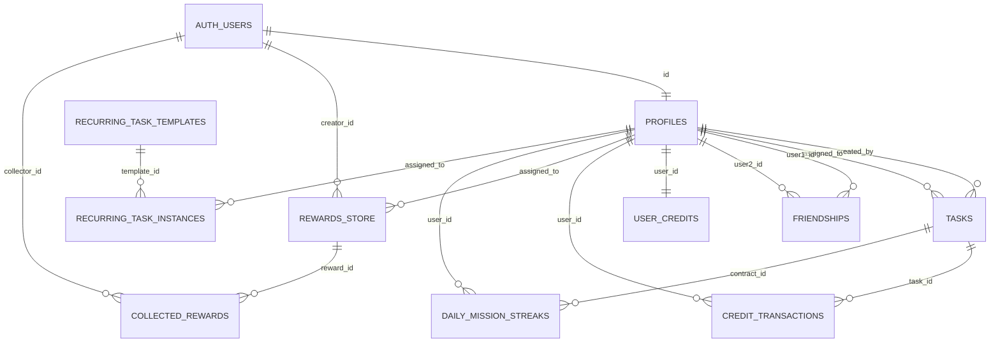

# 1. Data Architecture Summary

This repository is a React/Vite single-page app backed directly by Supabase. The browser uses `@supabase/supabase-js` with `VITE_SUPABASE_URL` and `VITE_SUPABASE_ANON_KEY` from `src/lib/supabase.ts`. There is no separate application server or ORM; the query layer is Supabase PostgREST, Supabase Auth, Supabase Storage, Supabase Realtime, SQL RPCs, and Supabase Edge Functions.

Database technology: Supabase Postgres. The local Supabase project is configured in `supabase/config.toml`; `public` and `graphql_public` are exposed API schemas, migrations are enabled, and seed SQL is `db/seeds/seed_minimal.sql`.

Migration system and schema locations:

- Migrations live in `supabase/migrations/*.sql`.
- Historical/proposed SQL lives under `db/proposals/*.sql`; these are not clearly applied migrations.
- Schema dumps live in `supabase/schema.sql` and `supabase/schema_all.sql`.
- Type snapshots live in `src/types/database.ts` and `src/types/rpc-types.ts`.
- NEEDS VERIFICATION: `supabase/schema.sql`, `supabase/schema_all.sql`, and `src/types/database.ts` appear stale relative to later migrations `supabase/migrations/20260412100100_lock_down_increment_user_credits.sql` and `supabase/migrations/20260412100200_phase1_reward_and_rpc_hardening.sql`. For example, `src/types/database.ts` still lists legacy `create_bounty`/`purchase_bounty` RPCs and omits `approve_task` and `purchase_reward`.

Client/server database access patterns:

- Client creates a single browser Supabase client in `src/lib/supabase.ts`.
- Protected routing is client-side only in `src/App.tsx`; backend access control depends on Supabase RLS and RPC checks.
- Most reads/writes are direct `.from(...).select/insert/update/delete` calls from hooks and domain modules.
- Sensitive reward purchase and task approval logic is pushed into `SECURITY DEFINER` RPCs: `approve_task`, `create_reward_store_item`, `update_reward_store_item`, `delete_reward_store_item`, `purchase_reward`, and `increment_user_credits`.
- Edge Functions use Supabase clients with either user JWTs or service-role keys, depending on function.

Main entities:

- `auth.users`: Supabase Auth users.
- `public.profiles`: user profiles and app role.
- `public.tasks`: missions/contracts/bounties assigned between users.
- `public.friendships`: friend/partner relationships.
- `public.user_credits`: current credit balance.
- `public.credit_transactions`: credit ledger entries.
- `public.rewards_store`: friend-created rewards that can be claimed with credits.
- `public.collected_rewards`: reward collection records.
- Legacy or uncertain: `public.marketplace_bounties`, `public.collected_bounties`, `public.daily_mission_streaks`, `public.recurring_task_instances`, `public.recurring_task_templates`, `public.recurring_contract_templates`, `public.recurring_contract_instances`.

Main relationships:

- `profiles.id` references `auth.users.id`.
- `tasks.created_by` and `tasks.assigned_to` reference `profiles.id`.
- `friendships.user1_id`, `friendships.user2_id`, and `friendships.requested_by` reference `profiles.id`.
- `user_credits.user_id` references `profiles.id`.
- `credit_transactions.user_id` references `profiles.id`; `credit_transactions.task_id` references `tasks.id`.
- `rewards_store.creator_id` references `auth.users.id`; `rewards_store.assigned_to` references `profiles.id`.
- `collected_rewards.reward_id` references `rewards_store.id`; `collected_rewards.collector_id` references `auth.users.id`.

# 2. Entity Relationship Map

NEEDS VERIFICATION: The recurring template table names are inconsistent. `supabase/migrations/20250615224500_create_or_update_recurring_task_instances.sql` references `public.recurring_task_templates`, while `supabase/functions/create-daily-tasks/index.ts` queries `recurring_contract_templates` and `recurring_contract_instances`.

## `auth.users`

Purpose: Supabase-managed authentication identity table.

Important fields: `id`, `email`, session/auth internals.

Relationships: one-to-one with `public.profiles`.

Who creates it: Supabase Auth via email/password, Google OAuth, or email OTP in `src/pages/Login.tsx`.

Who reads it: Supabase Auth APIs; client receives `User` via `supabase.auth.getSession()` and `onAuthStateChange()` in `src/context/AuthContext.tsx`.

Who updates/deletes it: Supabase Auth. No app-level account deletion flow found.

Business rules: Auth redirect URLs and token settings are configured in `supabase/config.toml`.

Risks: Email confirmations are disabled in local config; production auth settings need verification.

## `public.profiles`

Purpose: App user profile and app role store.

Important fields: `id`, `email`, `display_name`, `avatar_url`, `role`. Code also references `partner_user_id` in `src/context/AuthContext.tsx` and `src/pages/Friends.tsx`, but `src/types/database.ts` and `supabase/schema.sql` do not include this column. NEEDS VERIFICATION.

Relationships: `id` references `auth.users.id`; referenced by tasks, friendships, user credits, rewards.

Who creates it: `handle_new_user()` trigger in `supabase/schema.sql`; client bootstrap in `src/lib/profileBootstrap.ts`; profile upserts in `src/components/ProfileEditModal.tsx` and `src/pages/ProfileEdit.tsx`.

Who reads it: Public RLS policy `Public profiles` allows all profile rows to be selected (`supabase/schema_all.sql:2754`). Client search and joins read profile emails/display names.

Who updates it: Owner through `Update own profile` RLS (`supabase/schema_all.sql:2775`); profile UI updates display name/avatar. `setPartner()` updates `partner_user_id` in `src/context/AuthContext.tsx`.

Who deletes it: No app-level profile delete found.

Business rules: Profile is created on first auth if missing. `profileBootstrap` deliberately does not overwrite an existing profile.

Risks:

- CRITICAL: `role` is stored in `profiles`, and RLS appears to allow users to update their own profile without a restrictive column policy. A malicious user may be able to set `role = 'admin'`, then gain task-wide admin access through `Admins full access` on `tasks` (`supabase/schema_all.sql:2715`). NEEDS VERIFICATION against live RLS and column privileges.
- `Public profiles` exposes email addresses to any selector. This is used for friend search, but it is a data leakage/privacy risk.
- Schema/type drift around `partner_user_id`.

## `public.friendships`

Purpose: Friend/partner graph used to decide who can create assigned rewards and share missions.

Important fields: `id`, `user1_id`, `user2_id`, `status`, `requested_by`, `created_at`; unique pair `(user1_id, user2_id)`; no self-friendship check.

Relationships: references `profiles` for both users and requester.

Who creates it: `src/hooks/useFriends.ts` and `src/pages/Friends.tsx`.

Who reads it: `useFriends`, `usePartnerState`, reward RPCs, reward RLS policies.

Who updates it: Either participant via RLS policy `Update friendships` (`supabase/schema_all.sql:2761`); client accepts requests by setting `status = 'accepted'`.

Who deletes it: Requester can delete pending requests; code also attempts friend removal by deleting any friendship row.

Business rules: Requests are `pending` until accepted; accepted friendships allow reward creation.

Risks:

- `Update friendships` lacks a visible `WITH CHECK` restriction and may allow either participant to mutate columns beyond `status`, including `user1_id`, `user2_id`, or `requested_by`.
- Delete policy in schema only allows requester to delete pending requests (`supabase/schema_all.sql:2789`), so `removeFriend()` may fail unless live policies differ.

## `public.tasks`

Purpose: Missions/contracts/bounties assigned from a creator to an assignee.

Important fields: `id`, `created_by`, `assigned_to`, `title`, `description`, `deadline`, `reward_type`, `reward_text`, `status`, `proof_url`, `proof_type`, `proof_description`, `proof_required`, `completed_at`, `is_archived`, `is_daily`. Latest `approve_task` references `approved_at`, but the schema/type dump does not show that column. NEEDS VERIFICATION.

Relationships: creator and assignee reference `profiles`; credit transactions can reference tasks.

Who creates it: `useTasks.createTask()` in `src/hooks/useTasks.ts`; page-level task inserts also exist in `src/pages/IssuedPage.tsx`.

Who reads it: `useTasks`, `useIssuedContracts`, `useAssignedContracts`, `useArchivedContracts`, FTX gate, dashboard pages.

Who updates it: Creator and assignee through direct table updates; creator approvals through `approve_task` RPC.

Who deletes it: Creator via delete policy and `useTasks.deleteTask()`.

Business rules:

- Status values include `pending`, `in_progress`, `review`, `completed`, `rejected`, `archived`.
- Assignees upload proof and move to `review`.
- Creators approve `review` tasks via `approve_task`; this awards credits.
- Rejection resets status to `pending` and clears proof.
- Archiving sets `is_archived = true`.

Risks:

- RLS has broad update policies. `Update tasks` allows creator or assignee to update rows; `Users can update assigned tasks` also allows assignees. No visible column-level restrictions prevent clients from directly changing `reward_text`, `created_by`, `assigned_to`, or `status`.
- The `award_credits` trigger still exists in schema dumps and could double-award credits if live alongside `approve_task`; later migrations intend to use RPC awarding. NEEDS VERIFICATION in live DB.
- `approve_task` casts `reward_text::integer`; malformed reward text may throw.

## `public.user_credits`

Purpose: Current credit balance and total earned per user.

Important fields: `user_id`, `balance`, `total_earned`, `created_at`, `updated_at`.

Relationships: `user_id` references `profiles.id`.

Who creates it: `increment_user_credits`; client `useUserCredits` upserts missing rows; `award_credits` trigger in schema dumps.

Who reads it: credit display hooks and purchase RPC.

Who updates it: `increment_user_credits`, `purchase_reward`, and currently visible RLS policies that allow users to update their own credits.

Who deletes it: No delete flow found.

Business rules: Credits are earned when task creators approve credit-reward tasks; credits are spent by `purchase_reward`.

Risks:

- CRITICAL: Schema RLS includes `Users can insert own credits` and `Users can update own credits` (`supabase/schema_all.sql:2803`, `supabase/schema_all.sql:2824`). This appears to allow direct client-side credit minting by updating `balance` unless live grants/column privileges block it.
- `supabase/migrations/20260412100100_lock_down_increment_user_credits.sql` locks down only the increment RPC, not table update policies.
- No non-negative balance constraint is visible in applied migrations; `db/proposals/008_atomic_purchase.up.sql` has one, but it is not in `supabase/migrations`.

## `public.credit_transactions`

Purpose: Ledger of earned/spent credits.

Important fields: `id`, `user_id`, `task_id`, `amount`, `transaction_type`, `created_at`; transaction type check in schema dump allows only `earned` and `spent`.

Relationships: `user_id` to `profiles`; `task_id` to `tasks`.

Who creates it: `award_credits` trigger and `purchase_reward` RPC.

Who reads it: No client read found.

Who updates/deletes it: No app path found.

Business rules: Purchase writes negative `spent`; approvals write earned transactions.

Risks: RLS is enabled with no visible policies in schema dump, so client reads are blocked. This is acceptable if ledger is server-only, but analytics/admin needs are UNKNOWN.

## `public.rewards_store`

Purpose: Canonical reward/gift/bounty store. Friends create rewards assigned to a user; assigned users purchase/claim with credits.

Important fields: `id`, `name`, `description`, `image_url`, `credit_cost`, `creator_id`, `assigned_to`, `is_active`, `created_at`, `updated_at`.

Relationships: creator references `auth.users`; assignee references `profiles`; collected rows reference rewards.

Who creates it: normal flow through `create_reward_store_item` RPC; onboarding path inserts directly in `src/domain/rewards.ts`.

Who reads it: rewards store hook, collected rewards hook, FTX gate.

Who updates it: creator through `update_reward_store_item` RPC; purchase RPC marks `is_active = false`.

Who deletes it: creator through `delete_reward_store_item` RPC, which also deletes dependent `collected_rewards`.

Business rules:

- Normal creation requires authenticated user, non-empty name, cost 1..1,000,000, and accepted friendship with assignee.
- Purchase requires authenticated collector, `auth.uid() == p_collector_id`, active reward, not creator, sufficient credits, and no duplicate collection.

Risks:

- `src/hooks/useRewardsStore.ts` currently passes `p_assigned_to: user.id` when creating a reward, which conflicts with the RPC rule that the assignee must be an accepted friend. This may make creation fail or indicate UI/data contract mismatch.
- Onboarding direct insert uses `assigned_to: null`, while type/schema snapshots show `assigned_to` as non-null. `supabase/migrations/20250128000000_allow_unassigned_rewards_for_onboarding.sql` adds a policy for this but does not visibly alter nullability. NEEDS VERIFICATION.
- Storage image URLs are stored as public URLs without server-side ownership verification.

## `public.collected_rewards`

Purpose: Records reward claims.

Important fields: `id`, `reward_id`, `collector_id`, `collected_at`.

Relationships: reward to `rewards_store`; collector to `auth.users`.

Who creates it: `purchase_reward` RPC.

Who reads it: `useCollectedRewards` reads own rows.

Who updates/deletes it: `delete_reward_store_item` deletes rows for deleted rewards; no update path found.

Business rules: Unique duplicate prevention is implied by `purchase_reward` catching `unique_violation`, but schema dump does not show a unique constraint on `(reward_id, collector_id)`. NEEDS VERIFICATION.

Risks:

- RLS is enabled, but schema dump shows no policies for `collected_rewards`. `db/proposals/003_rls_collected_rewards.up.sql` has proposed policies, but not an applied migration. Client reads may fail in live unless policy exists outside dumps.
- Delete reward deletes collected rows, which removes purchase history.

## Legacy `public.marketplace_bounties` and `public.collected_bounties`

Purpose: Deprecated bounty store/collection tables.

Important fields: see `supabase/schema_all.sql:1357` and `supabase/schema_all.sql:1303`.

Relationships: marketplace creator to profiles; collected bounty to marketplace and collector profile.

Who creates/reads/updates/deletes: Latest migration `20260412100200` drops legacy RPCs, but tables remain in schema dump. No current client references found except stale types.

Business rules: Legacy bounty purchase semantics were inconsistent and are superseded by `rewards_store`/`collected_rewards`.

Risks: These tables appear to lack RLS enablement in `supabase/schema_all.sql`; proposal `db/proposals/006_rls_unused_tables.up.sql` would enable RLS but is not in migrations. Unused exposed tables should be dropped or locked down.

## `public.daily_mission_streaks`

Purpose: Track daily mission streaks per contract/user.

Important fields: `contract_id`, `user_id`, `streak_count`, `last_completion_date`.

Relationships: contract to `tasks`; user to `profiles`.

Who creates/updates it: `src/domain/streaks.ts` and hooks `useDailyMissionStreak.ts`; older `approve_task` versions included streak writes, but `20260109_approve_task_rpc_v3_no_streaks.sql` removed streak tracking.

Who reads it: streak hooks.

Who deletes it: cascade on task/profile deletion.

Business rules: Consecutive UTC-day completions increment streak.

Risks: Current approval RPC explicitly does not update streaks, so streak lifecycle may be disconnected from task approval.

## `public.recurring_task_instances` and recurring templates

Purpose: Intended recurring/daily task instance system.

Important fields from `supabase/migrations/20250615224500_create_or_update_recurring_task_instances.sql`: `template_id`, `assigned_to`, `status`, `scheduled_date`, `completed_at`, `proof_required`, `proof_url`, `proof_description`, `credit_value`, `created_at`.

Relationships: `template_id` references `public.recurring_task_templates(id)`; assignee references `profiles`.

Who creates it: `supabase/functions/create-daily-tasks/index.ts`, but that function uses different names: `recurring_contract_templates` and `recurring_contract_instances`.

Who reads/updates/deletes: `complete_task_instance()` RPC updates instances; no current client call found.

Business rules: `complete_task_instance` marks non-proof instances complete and awards credits; proof-required instances go to review.

Risks: Table names are inconsistent; no RLS policies visible for `recurring_task_instances`; `complete_task_instance` trusts `user_id_param` but filters `assigned_to = user_id_param` rather than `auth.uid() = user_id_param`.

# 3. Auth Model

Auth provider: Supabase Auth.

Signup/login flow:

- Email/password signup and login are implemented in `src/pages/Login.tsx`.
- Google OAuth is implemented with `supabase.auth.signInWithOAuth({ provider: 'google' })`.
- Email magic link is implemented with `supabase.auth.signInWithOtp()`.
- Redirect URL is `window.location.origin + '/login'`.

Session management:

- `src/context/AuthContext.tsx` calls `supabase.auth.getSession()` on mount and subscribes with `supabase.auth.onAuthStateChange()`.
- `src/App.tsx` also wraps the app with `SessionContextProvider` from `@supabase/auth-helpers-react`.
- Session persistence uses Supabase client defaults. Exact storage mode is not configured in code; Supabase JS typically stores session client-side. NEEDS VERIFICATION for production threat model.

Protected routes:

- Client-side `ProtectedRoute` in `src/App.tsx` checks `user` and `session`.
- Protected routes include `/`, `/onboarding`, `/friends`, `/archive`, `/profile/edit`, `/rewards-store`, `/my-rewards`, and `/issued`.
- Client-side route protection is UX only; Supabase RLS/RPCs are the backend boundary.

Server-side auth checks:

- RLS policies use `auth.uid()`.
- `approve_task` checks authenticated user and requires task creator.
- reward RPCs use `auth.uid()` and `SECURITY DEFINER`.
- `notify-reward-creator` validates the bearer token with `auth.getUser()` and requires `collector_id` to match requester.
- `create-daily-tasks` checks its `Authorization` header against `SUPABASE_SERVICE_ROLE_KEY`.
- Legacy email functions `send-new-bounty-alert` and `send-proof-submitted-alert` do not verify caller identity.

Client-side auth checks:

- Components check `useAuth()` state before performing actions.
- Hooks often filter by `user.id` or add `.eq('assigned_to', userId)`/`.eq('created_by', userId)`.
- These checks must be considered defense-in-depth only.

Role system:

- `profiles.role` defaults to `user` in schema dump.
- `tasks` has `Admins full access` policy: authenticated users whose profile role is `admin` can access all tasks.
- No dedicated server-side admin assignment flow found.

Permission model:

- Ownership is mostly creator/assignee based.
- Reward creation requires accepted friendship in canonical RPC.
- Reward purchase requires assigned/authenticated collector by implication of RLS and RPC checks, but latest `purchase_reward` RPC does not explicitly check `assigned_to = collector_id`; it only checks active reward, not creator, sufficient credits, and duplicate collection. NEEDS VERIFICATION against RLS bypass, because `SECURITY DEFINER` bypasses table RLS.

Admin/superuser behavior:

- Task admin access exists through `profiles.role = 'admin'`.
- Edge Functions using service role bypass RLS.

Risks or inconsistencies:

- Users may be able to self-escalate by updating `profiles.role`.
- Supabase config has `enable_confirmations = false`, `minimum_password_length = 6`, and `secure_password_change = false`; production values should be hardened.
- `src/types/database.ts` is stale and can hide RPC/schema contract mismatches.

# 4. Authorization and Security Rules

## RLS policies

Visible RLS policies in `supabase/schema_all.sql`:

- `profiles`: public select; owner update.
- `tasks`: creator/assignee select/update/delete; creator insert; admin full access.
- `friendships`: participants select/update; requester insert; requester can delete pending requests.
- `user_credits`: owner select/insert/update.
- `rewards_store`: owner/assigned-friend select; owner update/delete; friend-only insert.
- `collected_rewards`: RLS enabled, no visible policies in schema dump.
- `credit_transactions`: RLS enabled, no visible policies.
- `storage.objects`: public read for `bounty-proofs`; very broad public read policy; authenticated insert policy for `bounty-proofs`; avatar user upload/update policies.

NEEDS VERIFICATION: The live DB may differ from dumps because latest migrations are not reflected in schema dumps and proposals may or may not have been applied.

## Middleware guards

No backend middleware exists. React route guard is in `src/App.tsx` only.

## API permission checks

- `approve_task`: checks `auth.uid()` and creator ownership; atomic update guards status `review`.
- `create_reward_store_item`: checks auth, input basics, and accepted friendship.
- `update_reward_store_item`: checks auth, ownership, and input basics.
- `delete_reward_store_item`: checks auth and creator ownership.
- `purchase_reward`: checks auth, collector parameter matches `auth.uid()`, balance, active reward, self-purchase, duplicate insert. Missing explicit assignee/friendship check.
- `complete_task_instance`: checks row assigned to passed `user_id_param`, but not that `user_id_param = auth.uid()`.
- Edge `notify-reward-creator`: validates JWT, collector match, and collection row exists.
- Edge `send-new-bounty-alert` and `send-proof-submitted-alert`: no auth checks visible.

## SECURITY DEFINER functions/RPCs

- `approve_task` in `supabase/migrations/20260109_approve_task_rpc_v3_no_streaks.sql`.
- `increment_user_credits` in `supabase/migrations/20260412100100_lock_down_increment_user_credits.sql`.
- `create_reward_store_item`, `update_reward_store_item`, `delete_reward_store_item`, `purchase_reward` in `supabase/migrations/20260412100200_phase1_reward_and_rpc_hardening.sql`.
- `complete_task_instance` in `supabase/migrations/20231117000000_complete_task_instance.sql`.
- `handle_new_user` in schema dump.

Risks:

- `complete_task_instance` lacks `SET search_path`.
- `approve_task` uses `SET search_path = public`, not `public, pg_temp`.
- SECURITY DEFINER functions should fully schema-qualify tables/functions or set a hardened search path.

## Client trusted too much / missing validation

- `user_credits` policies appear to let users directly update balances.
- `profiles` policies appear to let users update `role`.
- `tasks` policies appear to allow broad column updates by assignees and creators.
- `friendships` update appears broad.
- File uploads validate MIME/size client-side only; storage policies do not enforce MIME type, size, owner path for `bounty-proofs`, or ownership path for `reward-images` in visible schema.
- Legacy Edge email functions accept arbitrary recipient/payload.

# 5. API Surface

This app has no Express/Next API routes. The API surface is Supabase table REST, RPCs, Storage, Realtime, and Edge Functions.

## Supabase Auth

`signUp`

- File: `src/pages/Login.tsx`
- Purpose: email/password signup.
- Request payload: email, password, `emailRedirectTo`.
- Response: Supabase `AuthResponse`.
- Auth requirement: unauthenticated.
- Permission logic: Supabase Auth config.
- DB operations: creates `auth.users`; profile may be created by DB trigger or client bootstrap.
- External services: Supabase Auth email if confirmations enabled.
- Validation: email/password non-empty; password length >= 6 client-side.
- Risks: production password policy and confirmation settings need verification.

`signInWithPassword`

- File: `src/pages/Login.tsx`
- Purpose: email/password login.
- Request payload: email, password.
- Response: Supabase session.
- Auth requirement: unauthenticated.
- Risks: no CAPTCHA visible; Supabase rate limits configured locally.

`signInWithOAuth`

- File: `src/pages/Login.tsx`
- Purpose: Google OAuth login.
- Request payload: provider `google`, redirect URL.
- External services: Google OAuth via Supabase.
- Risks: production redirect allow-list must match deployed origin.

`signInWithOtp`

- File: `src/pages/Login.tsx`
- Purpose: magic link login.
- Request payload: email, redirect URL.
- Risks: local config has `otp_expiry = 3600` and `max_frequency = "1s"`; production should use stricter values.

## Supabase RPCs

`approve_task(p_task_id uuid)`

- File: `supabase/migrations/20260109_approve_task_rpc_v3_no_streaks.sql`; called from `src/domain/missions.ts` and `src/hooks/useTasks.ts`.
- Purpose: approve reviewed task and award credits once.
- Request payload: `{ p_task_id }`.
- Response payload: JSONB `{ success, message }` or PostgreSQL exception.
- Auth requirement: authenticated; `GRANT EXECUTE TO authenticated`.
- Permission logic: `auth.uid()` must equal `tasks.created_by`; task status must be `review`.
- DB operations: atomic update `tasks.status = completed`, set `completed_at`, set `approved_at`; calls `increment_user_credits`.
- External services: none.
- Error handling: throws mapped messages in client.
- Validation: auth, task exists, creator, status.
- Risks: `approved_at` column absent from schema/type snapshots; `reward_text::integer` can throw; possible double-award if legacy `award_credits` trigger remains live.

`increment_user_credits(user_id_param uuid, amount_param integer)`

- File: `supabase/migrations/20260412100100_lock_down_increment_user_credits.sql`.
- Purpose: server-only helper to insert/increment credits.
- Request payload: user ID, positive amount.
- Response: void.
- Auth requirement: latest migration revokes public/anon/authenticated and grants only `service_role`.
- Permission logic: intended to be called from trusted RPCs.
- DB operations: upsert into `user_credits`.
- Risks: direct table RLS still appears to allow users to update their own `user_credits`.

`create_reward_store_item(p_name, p_description, p_image_url, p_credit_cost, p_assigned_to)`

- File: `supabase/migrations/20260412100200_phase1_reward_and_rpc_hardening.sql`; called from `src/domain/rewards.ts`, `src/hooks/useRewardsStore.ts`, and `src/hooks/useCreateBounty.ts`.
- Purpose: create reward assigned to accepted friend.
- Request payload: name, description, image URL, cost, assignee ID.
- Response: JSON `{ success, reward_id?, message?/error? }`.
- Auth requirement: authenticated.
- Permission logic: uses `auth.uid()` as creator and requires accepted friendship with assignee.
- DB operations: insert into `rewards_store`.
- External services: optional prior image upload to Supabase Storage.
- Validation: non-empty name, assignee required, cost 1..1,000,000.
- Risks: `useRewardsStore` passes current user as assignee, likely failing friendship check; onboarding bypass inserts directly.

`update_reward_store_item(p_bounty_id, p_name, p_description, p_image_url, p_credit_cost)`

- File: latest reward hardening migration; called from `src/domain/rewards.ts`.
- Purpose: update creator-owned reward.
- Request payload: reward ID named `p_bounty_id`, name, description, image URL, cost.
- Response: JSON `{ success }` or `{ success:false, error }`.
- Auth requirement: authenticated.
- Permission logic: reward `creator_id = auth.uid()`.
- DB operations: update `rewards_store`.
- Validation: auth, ID, non-empty name, cost range.
- Risks: parameter naming is legacy and may confuse clients/types.

`delete_reward_store_item(p_reward_id uuid)`

- File: latest reward hardening migration; called from `src/domain/rewards.ts`.
- Purpose: delete creator-owned reward and dependent collection rows.
- Request payload: reward ID.
- Response: JSON `{ success }`.
- Auth requirement: authenticated.
- Permission logic: reward `creator_id = auth.uid()`.
- DB operations: delete from `collected_rewards`, then `rewards_store`.
- Risks: deletes collection history; `src/types/database.ts` still declares `p_bounty_id`, not `p_reward_id`.

`purchase_reward(p_reward_id uuid, p_collector_id uuid)`

- File: latest reward hardening migration; called from `src/domain/rewards.ts`.
- Purpose: atomic reward purchase/claim with credits.
- Request payload: reward ID and collector ID.
- Response: JSON with success/error code, collection ID, reward name, cost, new balance.
- Auth requirement: authenticated.
- Permission logic: `auth.uid()` must match collector; cannot purchase own reward; reward must be active; sufficient credits; duplicate collection rejected.
- DB operations: `FOR UPDATE` lock `user_credits` and `rewards_store`; insert `collected_rewards`; insert `credit_transactions`; decrement `user_credits`; mark reward inactive.
- External services: `notify-reward-creator` may be invoked by client afterward.
- Validation: auth, collector match, active reward, balance, self-purchase.
- Risks: no explicit `assigned_to = p_collector_id` check in latest RPC despite comments in older migrations; if any active reward is visible/callable, a non-assignee may be able to buy it. NEEDS VERIFICATION.

`complete_task_instance(instance_id_param, user_id_param, proof_description_param)`

- File: `supabase/migrations/20231117000000_complete_task_instance.sql`.
- Purpose: complete recurring task instance; award credits if proof not required; otherwise submit proof for review.
- Request payload: instance ID, user ID, optional proof.
- Response: table containing JSONB object.
- Auth requirement: authenticated grant.
- Permission logic: row must have `assigned_to = user_id_param`; does not compare `user_id_param` to `auth.uid()`.
- DB operations: update `recurring_task_instances`; call `increment_user_credits`.
- Risks: table-name drift, missing RLS, and caller can provide another user's ID if they know an instance ID. HIGH.

## Direct table operations

`tasks` direct create/update/delete/read

- Files: `src/hooks/useTasks.ts`, `src/domain/missions.ts`, `src/hooks/useIssuedContracts.ts`, `src/hooks/useAssignedContracts.ts`, `src/hooks/useArchivedContracts.ts`, `src/pages/IssuedPage.tsx`.
- Purpose: task lifecycle and list views.
- Request payload: task columns.
- Auth requirement: authenticated via RLS.
- Permission logic: RLS creator/assignee policies and client filters.
- DB operations: insert/update/delete/select.
- Risks: broad update RLS lets clients bypass domain transition logic.

`profiles` direct upsert/update/read

- Files: `src/lib/profileBootstrap.ts`, `src/components/ProfileEditModal.tsx`, `src/pages/ProfileEdit.tsx`, `src/pages/Friends.tsx`, `src/context/AuthContext.tsx`.
- Purpose: profile bootstrapping, profile editing, friend search, partner selection.
- Auth requirement: owner for writes; public read.
- Risks: public email exposure; potential self-role escalation; schema drift for `partner_user_id`.

`friendships` direct CRUD

- Files: `src/hooks/useFriends.ts`, `src/pages/Friends.tsx`, `src/hooks/usePartnerState.ts`.
- Purpose: friend requests and partner state.
- Risks: broad update policy; delete policy may not match friend-removal UI.

`user_credits` direct read/upsert

- Files: `src/hooks/useUserCredits.ts`, `src/domain/credits.ts`, `src/components/UserCredits.tsx`.
- Purpose: display and initialize balances.
- Risks: direct client upsert/update can mint credits if RLS permits.

`rewards_store` direct read/onboarding insert

- Files: `src/hooks/useRewardsStore.ts`, `src/domain/rewards.ts`, `src/hooks/useCollectedRewards.ts`, `src/lib/ftxGate.ts`.
- Purpose: rewards store display and onboarding rewards.
- Risks: onboarding direct insert bypasses RPC business rules; nullability mismatch.

`collected_rewards` direct read

- File: `src/hooks/useCollectedRewards.ts`.
- Purpose: show collected rewards.
- Risks: RLS policies absent in schema dump.

## Edge Functions

`notify-reward-creator`

- Method/path: POST `/functions/v1/notify-reward-creator`.
- File: `supabase/functions/notify-reward-creator/index.ts`; called by `src/hooks/useRewardsStore.ts`.
- Purpose: email reward creator after purchase.
- Request payload: `{ reward_id, collector_id }`.
- Response payload: `{ message }` or `{ error }`.
- Auth requirement: bearer user JWT; function validates with Supabase Auth.
- Permission logic: requester ID must equal `collector_id`; collection row must exist.
- DB operations: service-role reads `collected_rewards`, `rewards_store`, `profiles`.
- External services: Resend email API.
- Env vars: `SUPABASE_URL`, `SUPABASE_ANON_KEY`, `SUPABASE_SERVICE_ROLE_KEY`, `RESEND_API_KEY`, `RESEND_FROM_EMAIL`.
- Data sent out: creator email, creator/collector names, reward name, email HTML.
- Error handling: returns 401/403/409/500/503; logs error message.
- Validation: auth header, required IDs.
- Risks: CORS `*`; HTML email interpolates DB/user-controlled names/reward names without escaping; no rate limiting beyond Supabase/Resend.

`create-daily-tasks`

- Method/path: POST `/functions/v1/create-daily-tasks`.
- File: `supabase/functions/create-daily-tasks/index.ts`.
- Purpose: scheduled creation of daily recurring task instances.
- Request payload: none.
- Response payload: JSON counts/errors.
- Auth requirement: `Authorization` header must equal `Bearer ${SUPABASE_SERVICE_ROLE_KEY}`.
- Permission logic: shared secret equals service-role key.
- DB operations: service-role reads recurring templates/instances and inserts instances.
- Env vars: `SUPABASE_URL`, `SUPABASE_SERVICE_ROLE_KEY`.
- Error handling: per-template errors collected; function returns 500 if any errors.
- Validation: auth header only.
- Risks: using the service-role key itself as a bearer cron secret increases blast radius if logs/config leak. Use a separate cron secret.
- NEEDS VERIFICATION: table names used by function do not match migration names.

`send-new-bounty-alert`

- Method/path: POST `/functions/v1/send-new-bounty-alert`.
- File: `supabase/functions/send-new-bounty-alert/index.ts`.
- Purpose: legacy email when a bounty/task is assigned.
- Request payload: `{ assigneeEmail, assigneeName, taskTitle, taskId, appUrl? }`.
- Response payload: `{ message }` or `{ error }`.
- Auth requirement: none visible.
- Permission logic: none visible.
- DB operations: none.
- External services: Gmail SMTP via nodemailer OAuth2.
- Env vars: `SITE_URL`, `GMAIL_USER`, `GMAIL_CLIENT_ID`, `GMAIL_CLIENT_SECRET`, `GMAIL_REFRESH_TOKEN`.
- Data sent out: arbitrary recipient email and task fields supplied by caller.
- Error handling: 400 missing email; 500 not configured/send error.
- Risks: open email relay if deployed publicly; HTML interpolation without escaping; no CORS/auth/rate limit. Latest migration drops DB trigger that called it, but the function remains.

`send-proof-submitted-alert`

- Method/path: POST `/functions/v1/send-proof-submitted-alert`.
- File: `supabase/functions/send-proof-submitted-alert/index.ts`.
- Purpose: legacy email when proof is submitted.
- Request payload: `{ creatorEmail, creatorName, taskTitle, taskId, proofId, appUrl? }`.
- Response payload: `{ message }` or `{ error }`.
- Auth requirement: none visible.
- Permission logic: none visible.
- DB operations: none.
- External services: Gmail SMTP via nodemailer OAuth2.
- Env vars: same Gmail/SITE_URL vars.
- Risks: open email relay if deployed; HTML interpolation; no caller verification.

# 6. Storage and Media

Storage provider: Supabase Storage.

Buckets/containers:

- `bounty-proofs`: used for task proof uploads in `src/hooks/useTasks.ts` and `src/domain/missions.ts`.
- `avatars`: used for profile avatar uploads in `src/components/ProfileEditModal.tsx` and `src/pages/ProfileEdit.tsx`.
- `reward-images`: used by `src/lib/rewardImageUpload.ts`.

File upload flows:

- Proof upload: validates client-side file size/type, uploads to `bounty-proofs`, stores public URL on `tasks.proof_url`, then sets task status to `review`.
- Avatar upload: uploads to `avatars` path `${user.id}/avatar-${Date.now()}.${ext}`, gets public URL, writes `profiles.avatar_url`.
- Reward image upload: validates image MIME and <= 5MB in client, uploads `rewards/{creatorId}/{bountyId}-{timestamp}.${ext}` to `reward-images`, stores public URL on reward.

File naming conventions:

- Proofs: `proofs/{taskId}/{timestamp}.{ext}` in `useTasks`, and `proofs/{missionId}/{Date.now()}_{originalName}` in `src/domain/missions.ts`.
- Avatars: `{user.id}/avatar-{timestamp}.{ext}`.
- Reward images: `rewards/{creatorId}/{bountyId}-{timestamp}.{ext}`.

Public/private access:

- `bounty-proofs` public select is visible for anon in `supabase/schema_all.sql:2924`.
- A broad storage policy `Public Read Access ... USING (true)` is visible in `supabase/schema_all.sql:2931`; this appears to allow public read of all storage objects, not just avatars. NEEDS VERIFICATION.
- `avatars` has path-owner insert/update policy based on first folder = `auth.uid()`, but the insert policy does not restrict bucket to `avatars`.
- No visible storage policy for `reward-images` in schema dump.

Signed URL usage: none found. Code uses `getPublicUrl()` for proof, avatar, and reward image media.

Cache-busting/versioning: profile avatar rendering sometimes appends `?v={updated_at}` in `src/pages/Friends.tsx`; `profiles.updated_at` is not visible in schema dump. NEEDS VERIFICATION.

Image/video/audio handling:

- Proofs accept image/video in domain upload path; `tasks_proof_type_check` in schema dump only allows `image` and `video`, but code can set `proof_type = 'text'` in `src/domain/missions.ts`, creating a constraint mismatch. NEEDS VERIFICATION.
- Avatar accepts PNG/JPEG/GIF in UI.
- Reward images accept JPEG/PNG/GIF/WebP.
- Public static audio files live under `public/sounds`/`dist/sounds`; not part of uploaded media.

Cleanup/deletion behavior:

- `useTasks.deleteTask()` attempts to delete proof storage object if it can parse a public URL and derive path.
- Reward deletion deletes DB rows only; no reward image cleanup found.
- Avatar replacement uses upsert with new timestamp path; old avatars are not removed.
- `delete_reward_store_item` deletes collected reward records before reward deletion.

Risks:

- Public proof uploads may expose sensitive user submissions.
- Storage policies for `bounty-proofs` allow any authenticated upload to bucket without path ownership binding.
- Client-side MIME validation is not enough; storage policy does not enforce MIME or extension.
- Original proof file names may be included in one upload path.
- Old media orphaning likely.

# 7. External Services

## Supabase

Purpose: Auth, Postgres, Storage, Realtime, Edge Functions.

Where configured: `.env.local`, `src/lib/supabase.ts`, `supabase/config.toml`.

Where called: throughout `src`, `supabase/functions`.

Required env vars: `VITE_SUPABASE_URL`, `VITE_SUPABASE_ANON_KEY`; Edge Functions also need `SUPABASE_URL`, `SUPABASE_ANON_KEY`, `SUPABASE_SERVICE_ROLE_KEY`.

Data sent out: all app data to Supabase project.

Data received: auth sessions, DB rows, public URLs, realtime events.

Error handling: mixed; many hooks toast errors, some swallow errors.

Cost/scaling implications: direct browser queries and realtime subscriptions can amplify DB load; `max_rows = 1000` in local Supabase API config.

Fallback behavior: limited; errors usually show toast or empty state.

Risks: RLS is the primary security boundary; several policies appear too broad.

## Resend

Purpose: send reward purchase notification emails.

Where configured: Edge env vars `RESEND_API_KEY`, `RESEND_FROM_EMAIL`.

Where called: `supabase/functions/notify-reward-creator/index.ts`.

Data sent out: recipient email, subject, HTML body with names and reward title.

Data received: Resend HTTP status/body.

Error handling: non-OK response throws; missing config returns 503.

Cost/scaling implications: one email per purchase notification; no dedupe/idempotency/rate limiting visible.

Fallback behavior: purchase succeeds even if client notification function fails; `triggerNotification()` catches and ignores errors.

Risks: HTML not escaped; no idempotency key.

## Gmail SMTP / Google OAuth2

Purpose: legacy bounty/proof notification emails.

Where configured: Edge env vars `GMAIL_USER`, `GMAIL_CLIENT_ID`, `GMAIL_CLIENT_SECRET`, `GMAIL_REFRESH_TOKEN`, `SITE_URL`; helper scripts `get-refresh-token.cjs` and `get-refresh-token.mjs`.

Where called: `supabase/functions/send-new-bounty-alert/index.ts`, `supabase/functions/send-proof-submitted-alert/index.ts`.

Data sent out: caller-supplied recipient emails, names, task titles, links.

Error handling: returns 500 if not configured/send failure.

Cost/scaling implications: Gmail sending quotas; open relay risk can exhaust quota.

Fallback behavior: none.

Risks:

- HIGH: helper scripts contain a hard-coded OAuth client secret. Do not publish; rotate if exposed.
- HIGH: functions have no auth verification.

## Google Fonts

Purpose: load fonts in `index.html`.

Where configured/called: `index.html` loads `fonts.googleapis.com` and `fonts.gstatic.com`.

Data sent out: browser requests to Google Fonts.

Risks: no CSP visible; privacy/availability dependency.

## Third-party avatar fallback

Purpose: default avatar rendering.

Where called: `src/pages/Friends.tsx` uses `https://avatar.iran.liara.run/...`.

Data sent out: encoded email/display identifiers in URL query/path.

Risks: leaks user identifiers to third-party avatar service; no proxying/caching.

# 8. Background Jobs, Queues, Webhooks, and Async Logic

Queue system: none found.

Worker scripts: none found beyond Edge Functions.

Webhooks: no inbound third-party webhooks found.

Cron jobs:

- `create-daily-tasks` is designed to be called by cron, but no cron schedule config was found in repository.
- It should be invoked with a secret; current code compares bearer token to service-role key.

Polling:

- Hooks fetch on mount and refresh after mutations.
- Friend search has 300ms debounce.

Realtime:

- `useTasks`, `useFriends`, `usePartnerState`, and `UserCredits` use Supabase Realtime channels.

Long-running jobs/generation jobs: none found.

Retry logic:

- Minimal. Edge `create-daily-tasks` continues per-template after individual errors but has no retry queue.
- Client mutations generally do not retry.

Idempotency:

- `approve_task` is idempotent for already completed tasks and avoids double-credit via atomic status update.
- `purchase_reward` uses row locks and duplicate insert handling; unique constraint needs verification.
- `create-daily-tasks` checks existing instance for today before insert, but without a visible DB unique constraint it can race.

Failure states:

- Notification email failures do not roll back purchase.
- Proof upload can orphan a storage object if DB update fails.
- Reward image/avatar uploads can orphan old objects.

# 9. Data Consistency and Lifecycle

Task lifecycle:

- Create as `pending`.
- Assignee may move to `in_progress`.
- Assignee submits proof or no-proof completion to `review`.
- Creator approves via `approve_task`, moving to `completed` and awarding credits.
- Creator rejects, resetting to `pending` and clearing proof.
- Either creator or assignee can archive through UI, but archive is global `is_archived = true`.

Reward lifecycle:

- Creator creates reward for accepted friend through RPC, or onboarding tries a direct unassigned insert.
- Reward starts active (`is_active = true`).
- Collector purchases through `purchase_reward`; credits are deducted, `collected_rewards` row is inserted, reward is marked inactive.
- Creator can delete reward; current RPC deletes collection rows first.

Friendship lifecycle:

- Requester inserts `pending`.
- Recipient accepts by updating status to `accepted`; recipient can reject by delete.
- Requester can cancel pending request.
- Friend removal may not work under visible delete policy.

Credit lifecycle:

- Missing balance rows may be initialized to 0 by client.
- Credits are awarded on task approval.
- Credits are spent on reward purchase.
- Ledger records are written for award/spend but are not exposed by UI.

Approval/review flows:

- Task approval is server-side RPC.
- Reward purchase is server-side RPC.
- No admin review flow found beyond task admin RLS.

Payment states: none found. This is virtual credits only.

Deletion/archive behavior:

- Tasks can be deleted by creator; proof storage cleanup is best-effort.
- Tasks can be archived globally.
- Reward delete deletes purchase history and reward row.
- User/profile/account deletion not implemented.

Orphaned data risks:

- Storage objects for reward images and avatars.
- Proof object if task update fails after upload.
- Credits/transactions if user/profile deleted without cascade.
- Legacy marketplace tables.

Race conditions:

- `approve_task` and `purchase_reward` have explicit atomic/locking logic.
- `create-daily-tasks` can race without unique `(template_id, scheduled_date)`.
- Client profile bootstrap handles duplicate profile insert race.

# 10. Security Review

Exposed secrets risk:

- CRITICAL: `supabase/schema.sql`, `supabase/schema_all.sql`, and schema backups contain a hard-coded service-role bearer JWT in the legacy `notify_new_bounty` function body. The latest migration drops that function, but the secret remains in repository files and should be considered compromised if committed/shared.
- HIGH: `get-refresh-token.cjs` and `get-refresh-token.mjs` contain a hard-coded Google OAuth client secret. Rotate if real.
- `.env.local` contains Vite Supabase public values and is ignored by `*.local`; the anon key is public by design, but should be scoped by RLS.

Missing server-side checks:

- `purchase_reward` should verify `rewards_store.assigned_to = auth.uid()` or accepted relationship, because SECURITY DEFINER bypasses RLS.
- `complete_task_instance` should verify `auth.uid() = user_id_param`.
- Legacy Edge email functions should verify caller and authorization or be removed.

Overpowered client access:

- Users appear able to update their own credits.
- Users appear able to update their own profile role.
- Creators/assignees appear able to update broad task columns directly.
- Friendship update appears broad.

RLS gaps:

- `collected_rewards` policies absent from applied migrations/dump.
- `credit_transactions` policies absent; may be intended server-only.
- Legacy `marketplace_bounties` and `collected_bounties` not visibly RLS-enabled in schema dump.

Unsafe public storage:

- Proofs are public.
- Broad storage public read policy may expose every bucket.
- No server-side storage type/size/ownership policy visible for proof and reward images.

Injection risks:

- React rendering generally uses JSX escaping; no `dangerouslySetInnerHTML` found in `src`.
- Edge email HTML templates interpolate names, titles, reward names, URLs without escaping. If those strings can contain HTML, email HTML injection is possible.
- PostgREST `.or()` filters interpolate UUID/user IDs from trusted auth/profile state; search strings use `.ilike()` builder. Risk is low but central validation would be cleaner.

Webhook verification gaps:

- No incoming webhooks found.
- Edge legacy email functions are unauthenticated.

Data leakage:

- Public profile select exposes emails.
- Public storage exposes proofs/media.
- Third-party avatar fallback leaks email-derived identifiers.
- Public source maps in `dist` may expose internals if deployed.

Missing rate limiting:

- No app-level rate limits on RPCs or Edge Functions.
- Supabase Auth local config has rate limits, but production must be verified.
- Reward notification function can be invoked repeatedly after a valid purchase unless deduped/rate limited.

# 11. Refactor/Hardening Candidates

1. Problem: Users may self-mint credits through direct `user_credits` table update/insert.
   Files: `supabase/schema_all.sql`, `supabase/migrations/*`, `src/hooks/useUserCredits.ts`.
   Severity: Critical.
   Suggested improvement: Revoke authenticated insert/update on `user_credits`; expose read-only owner select; create balances only through server-side RPCs/triggers.
   Why it matters before launch: virtual economy integrity depends on unforgeable balances.

2. Problem: Users may self-escalate to admin by updating `profiles.role`.
   Files: `supabase/schema_all.sql`, `src/components/ProfileEditModal.tsx`, `src/pages/ProfileEdit.tsx`.
   Severity: Critical.
   Suggested improvement: Remove `role` from owner-updatable profile surface; split roles into protected table or restrict updates with column privileges/RPC.
   Why it matters before launch: `profiles.role = 'admin'` grants broad task access.

3. Problem: `tasks` update policies appear too broad.
   Files: `supabase/schema_all.sql`, `src/hooks/useTasks.ts`, `src/domain/missions.ts`.
   Severity: High.
   Suggested improvement: Replace direct task status/field updates with RPCs that enforce role, allowed fields, status transitions, and proof rules.
   Why it matters before launch: clients can bypass domain logic and potentially alter rewards/status.

4. Problem: `purchase_reward` does not visibly enforce assignee ownership.
   Files: `supabase/migrations/20260412100200_phase1_reward_and_rpc_hardening.sql`, `src/domain/rewards.ts`.
   Severity: High.
   Suggested improvement: Add `AND assigned_to = auth.uid()` or an explicit accepted-friend/business authorization check inside the SECURITY DEFINER RPC.
   Why it matters before launch: any callable RPC bug can let users claim rewards not intended for them.

5. Problem: Hard-coded secrets are present in repo files.
   Files: `supabase/schema.sql`, `supabase/schema_all.sql`, `supabase/schema_backup_*.sql`, `get-refresh-token.cjs`, `get-refresh-token.mjs`.
   Severity: High/Critical depending on exposure.
   Suggested improvement: Rotate exposed tokens/secrets, remove secrets from dumps/scripts, use env var placeholders, and purge from git history if published.
   Why it matters before launch: leaked service-role or OAuth credentials can compromise project data/email.

6. Problem: Public storage policies are broad and proofs are public.
   Files: `supabase/schema_all.sql`, `src/hooks/useTasks.ts`, `src/domain/missions.ts`, `src/lib/rewardImageUpload.ts`.
   Severity: High.
   Suggested improvement: Use private buckets for proofs, signed URLs for authorized viewers, path ownership checks, MIME/size restrictions, and cleanup jobs.
   Why it matters before launch: user proof media can contain sensitive content.

7. Problem: Legacy unauthenticated email Edge Functions can be abused.
   Files: `supabase/functions/send-new-bounty-alert/index.ts`, `supabase/functions/send-proof-submitted-alert/index.ts`.
   Severity: High.
   Suggested improvement: Delete undeployed legacy functions or require JWT plus DB ownership verification; add rate limiting and idempotency.
   Why it matters before launch: open email endpoints can leak, spam, and exhaust quotas.

8. Problem: Schema/type drift obscures real contracts.
   Files: `supabase/schema.sql`, `supabase/schema_all.sql`, `src/types/database.ts`, `src/types/rpc-types.ts`, `supabase/migrations/*.sql`.
   Severity: Medium.
   Suggested improvement: Regenerate schema dumps/types from live DB after migrations; remove legacy tables/functions from generated types.
   Why it matters before launch: stale contracts cause runtime failures and hide security assumptions.

9. Problem: Recurring task system has inconsistent table names and weak RPC auth.
   Files: `supabase/functions/create-daily-tasks/index.ts`, `supabase/migrations/20250615224500_create_or_update_recurring_task_instances.sql`, `supabase/migrations/20231117000000_complete_task_instance.sql`.
   Severity: Medium/High.
   Suggested improvement: Standardize table names, add RLS and unique constraints, verify `auth.uid()` inside RPC, and use a separate cron secret.
   Why it matters before launch: recurring jobs may fail or mutate data for the wrong user.

10. Problem: Public profile search exposes emails.
    Files: `supabase/schema_all.sql`, `src/pages/Friends.tsx`, `src/hooks/useFriends.ts`.
    Severity: Medium.
    Suggested improvement: Limit profile public fields, expose friend search through an RPC that returns minimal data and rate limits searches.
    Why it matters before launch: email harvesting and user enumeration are likely once public.

11. Problem: Notification functions interpolate user-controlled strings into HTML emails.
    Files: `supabase/functions/notify-reward-creator/index.ts`, `supabase/functions/send-new-bounty-alert/index.ts`, `supabase/functions/send-proof-submitted-alert/index.ts`.
    Severity: Medium.
    Suggested improvement: HTML-escape all interpolated fields and validate URLs.
    Why it matters before launch: stored/user-controlled names and titles can inject HTML into outgoing emails.

12. Problem: Missing media cleanup and orphan handling.
    Files: `src/hooks/useTasks.ts`, `src/components/ProfileEditModal.tsx`, `src/pages/ProfileEdit.tsx`, `src/lib/rewardImageUpload.ts`, reward delete RPC.
    Severity: Low/Medium.
    Suggested improvement: Track storage object paths separately from public URLs, delete replaced media, and perform periodic orphan cleanup.
    Why it matters before launch: storage cost and privacy exposure accumulate over time.
