# Bounty Hunter App - Live Database ERD

**Generated from**: `supabase/schema_all.sql`
**Date**: 2025-01-25
**Status**: 🔴 **CRITICAL SECURITY GAPS IDENTIFIED**

---

## Security Status Legend

- 🟢 **SECURE** - RLS enabled with policies
- 🟡 **PARTIAL** - RLS enabled but incomplete policies
- 🔴 **VULNERABLE** - RLS enabled but NO policies OR RLS not enabled
- ⚫ **UNUSED** - Table exists but not referenced in app code

---

## Entity Relationship Diagram

```mermaid
erDiagram
    %% Core tables with security status
    profiles ||--o{ tasks_created : "creates (🟢 SECURE)"
    profiles ||--o{ tasks_assigned : "assigned (🟢 SECURE)"
    profiles ||--o{ friendships_user1 : "initiates (🟢 SECURE)"
    profiles ||--o{ friendships_user2 : "receives (🟢 SECURE)"
    profiles ||--|| user_credits : "has (🟢 SECURE)"
    profiles ||--o{ credit_transactions : "logs (🔴 NO POLICIES)"

    %% Rewards system - MIXED SECURITY
    profiles ||--o{ rewards_store : "creates (🟢 SECURE)"
    profiles ||--o{ rewards_store_assigned : "assigned (🟢 SECURE)"
    profiles ||--o{ collected_rewards : "collects (🔴 NO POLICIES)"

    %% Unused duplicate tables - CRITICAL GAPS
    profiles ||--o{ marketplace_bounties : "creates (🔴 NO RLS)"
    profiles ||--o{ collected_bounties : "collects (🔴 NO POLICIES)"

    tasks }o--|| profiles_created_by : "created_by"
    tasks }o--|| profiles_assigned_to : "assigned_to"

    friendships }o--|| profiles_user1 : "user1_id"
    friendships }o--|| profiles_user2 : "user2_id"
    friendships }o--|| profiles_requested_by : "requested_by"

    rewards_store ||--o{ collected_rewards : "claimed_as"
    rewards_store }o--|| profiles_creator : "creator_id"
    rewards_store }o--|| profiles_assigned : "assigned_to"

    marketplace_bounties ||--o{ collected_bounties : "claimed_as"
    marketplace_bounties }o--|| profiles_creator : "creator_id"

    collected_rewards }o--|| rewards_store : "reward_id"
    collected_rewards }o--|| profiles : "collector_id"

    collected_bounties }o--|| marketplace_bounties : "bounty_id"
    collected_bounties }o--|| profiles : "collector_id"

    user_credits }o--|| profiles : "user_id (1:1)"

    credit_transactions }o--|| profiles : "user_id"
    credit_transactions }o--|| tasks : "task_id"

    %% Table definitions with security annotations
    profiles {
        uuid id PK "FK→auth.users | 🟢 RLS+Policies"
        text email UK "Unique | 🟢 Public readable"
        text display_name "🟢"
        text avatar_url "🟢"
        text role "admin check | 🟢"
        timestamptz created_at "🟢"
    }

    tasks {
        uuid id PK "🟢 RLS+9 Policies"
        uuid created_by FK "🟢"
        uuid assigned_to FK "🟢"
        text title "🟢"
        text description "🟢"
        text status "CHECK constraint | 🟢"
        text reward_type "🟢"
        text reward_text "Credits awarded | 🟢"
        boolean proof_required "🟢"
        text proof_url "Storage URL | 🟢"
        text proof_type "image/video | 🟢"
        text proof_description "🟢"
        date deadline "🟢"
        timestamptz created_at "🟢"
        timestamptz completed_at "Triggers credit award | 🟢"
        boolean is_archived "🟢"
    }

    friendships {
        uuid id PK "🟢 RLS+3 Policies"
        uuid user1_id FK "UNIQUE(user1_id+user2_id) | 🟢"
        uuid user2_id FK "🟢"
        text status "pending/accepted | 🟢"
        uuid requested_by FK "🟢"
        timestamptz created_at "🟢"
    }

    rewards_store {
        uuid id PK "🟢 RLS+4 Policies"
        text name "🟢"
        text description "🟢"
        text image_url "🟢"
        integer credit_cost "🟢"
        uuid creator_id FK "🟢"
        uuid assigned_to FK "Required | 🟢"
        boolean is_active "🟢"
        timestamptz created_at "🟢"
        timestamptz updated_at "🟢"
    }

    collected_rewards {
        uuid id PK "🔴 RLS enabled but NO POLICIES"
        uuid reward_id FK "🔴 No UNIQUE constraint"
        uuid collector_id FK "🔴"
        timestamptz collected_at "🔴"
    }

    user_credits {
        uuid user_id PK "1:1 with profiles | 🟢 RLS+3 Policies"
        integer balance "🟢"
        integer total_earned "🟢"
        timestamptz created_at "🟢"
        timestamptz updated_at "🟢"
    }

    credit_transactions {
        uuid id PK "🔴 RLS enabled but NO POLICIES"
        uuid user_id FK "🔴"
        uuid task_id FK "🔴"
        integer amount "🔴"
        varchar transaction_type "earned/spent | 🔴"
        timestamptz created_at "🔴"
    }

    marketplace_bounties {
        uuid id PK "🔴 NO RLS AT ALL (unused table)"
        text name "🔴"
        text description "🔴"
        text image_url "🔴"
        integer credit_cost "🔴"
        uuid creator_id FK "🔴"
        boolean is_active "🔴"
        text bounty_type "credit/direct | 🔴"
        text direct_reward "🔴"
        timestamptz created_at "🔴"
        timestamptz updated_at "Trigger: on_bounties_updated | 🔴"
    }

    collected_bounties {
        uuid id PK "🔴 RLS enabled but NO POLICIES"
        uuid bounty_id FK "🔴 UNIQUE w/ collector_id (good)"
        uuid collector_id FK "🔴"
        timestamptz collected_at "🔴"
    }
```

---

## Critical Security Findings

### 🔴 IMMEDIATE ACTION REQUIRED

#### 1. `marketplace_bounties` - NO RLS
- **Status**: RLS **NOT ENABLED** (see line 2875+ in schema - only collected_rewards/credit_transactions/friendships/profiles/rewards_store/tasks/user_credits have RLS)
- **Risk**: Anyone can read/write all bounties
- **Used by app**: ❌ NO (duplicate of `rewards_store`)
- **Action**: Either enable RLS + add policies OR drop table entirely

#### 2. `collected_bounties` - RLS but NO POLICIES
- **Status**: RLS enabled (line 2875) but zero policies
- **Risk**: RLS blocks ALL access (even legitimate reads)
- **Used by app**: ❌ NO (duplicate of `collected_rewards`)
- **Action**: Either add policies OR drop table

#### 3. `collected_rewards` - RLS but NO POLICIES
- **Status**: RLS enabled (line 2875) but zero policies
- **Risk**: RLS blocks ALL access (users can't see their collected rewards)
- **Used by app**: ✅ YES ([useCollectedRewards.ts:53](../../src/hooks/useCollectedRewards.ts#L53))
- **Action**: ADD POLICIES immediately
- **Missing**: `UNIQUE(reward_id, collector_id)` constraint (race condition risk)

#### 4. `credit_transactions` - RLS but NO POLICIES
- **Status**: RLS enabled (line 2881) but zero policies
- **Risk**: Can't query audit log (if needed)
- **Used by app**: ❌ NO (ledger table, currently unused)
- **Action**: Add policies if auditing needed, otherwise safe as-is

---

## Application Usage Matrix

| Table | Used By App | Component/Hook | Security Status |
|-------|-------------|----------------|-----------------|
| `profiles` | ✅ YES | useAuth, all pages | 🟢 SECURE |
| `tasks` | ✅ YES | useTasks, Dashboard, IssuedPage | 🟢 SECURE |
| `friendships` | ✅ YES | useFriends, Friends.tsx | 🟢 SECURE |
| `rewards_store` | ✅ YES | useRewardsStore, RewardsStorePage | 🟢 SECURE |
| `collected_rewards` | ✅ YES | useCollectedRewards, MyCollectedRewardsPage | 🔴 **BROKEN** |
| `user_credits` | ✅ YES | UserCredits component, Layout | 🟢 SECURE |
| `credit_transactions` | ❌ NO | (audit ledger - unused) | 🟡 Safe if unused |
| `marketplace_bounties` | ❌ NO | (duplicate of rewards_store) | 🔴 **DANGEROUS** |
| `collected_bounties` | ❌ NO | (duplicate of collected_rewards) | 🔴 **BROKEN** |

---

## Recommendations

### Option A: Minimal Fix (Fastest)
1. **ADD** policies to `collected_rewards` (3 policies - see proposal 003)
2. **ADD** `UNIQUE` constraint to `collected_rewards(reward_id, collector_id)`
3. **IGNORE** `marketplace_bounties` (no RLS, but unused = safe)
4. **IGNORE** `collected_bounties` (has RLS but no policies, but unused = harmless)
5. **IGNORE** `credit_transactions` (RLS but no policies, but unused = safe)

**Time**: 15 minutes
**Risk**: Low (only touches active table)

### Option B: Complete Cleanup (Recommended)
1. **DROP** `marketplace_bounties` table (unused duplicate)
2. **DROP** `collected_bounties` table (unused duplicate)
3. **ADD** policies to `collected_rewards`
4. **ADD** `UNIQUE` constraint to `collected_rewards`
5. **ADD** policies to `credit_transactions` (future-proof for auditing)

**Time**: 30 minutes
**Risk**: Low (only drops unused tables)

---

## Triggers & Automation

| Trigger | Table | Function | Purpose | Status |
|---------|-------|----------|---------|--------|
| `on_auth_user_created` | auth.users | `handle_new_user()` | Auto-create profile on signup | ✅ Working |
| `award_credits_on_completion` | tasks | `award_credits()` | Auto-award credits when task.status='completed' | ✅ Working |
| `on_bounties_updated` | marketplace_bounties | `handle_bounties_updated_at()` | Update updated_at timestamp | ⚠️ On unused table |

---

**Last Updated**: 2025-01-25
**Next Step**: Review proposals in `/db/proposals/` directory
